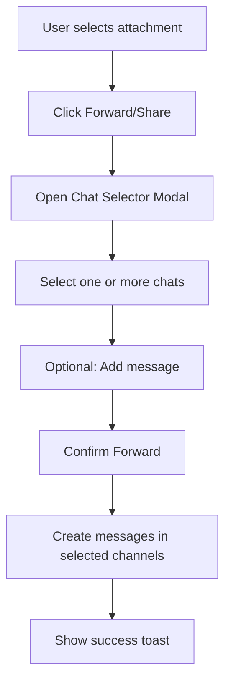
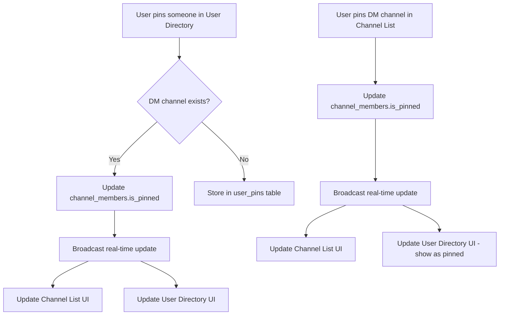

# Communication Module Enhancement Plan - Phase 2
## Attachment UI & Pin Sync Improvements (Features 26-31)

**Version:** 1.0  
**Created:** January 2025  
**Status:** Planning  
**Priority:** High  

---

## Executive Summary

This document outlines the comprehensive implementation plan for 6 new features focused on enhancing the attachment experience and pin synchronization in the communication module. These features will bring the communication system closer to professional messaging apps like WhatsApp and Slack.

---

## Table of Contents

1. [Feature Overview](#feature-overview)
2. [Feature 26: Professional Attachment Previews](#feature-26-professional-attachment-previews)
3. [Feature 27: Multiple Attachment Share Options](#feature-27-multiple-attachment-share-options)
4. [Feature 28: Share Attachments to Multiple Chats](#feature-28-share-attachments-to-multiple-chats)
5. [Feature 29: Message Input Attachment Preview](#feature-29-message-input-attachment-preview)
6. [Feature 30: Pin Sync Between User Directory and Chat Lists](#feature-30-pin-sync-between-user-directory-and-chat-lists)
7. [Feature 31: WhatsApp-Style Attachment Gallery](#feature-31-whatsapp-style-attachment-gallery)
8. [Database Schema Changes](#database-schema-changes)
9. [Implementation Priority](#implementation-priority)
10. [Testing Strategy](#testing-strategy)

---

## Feature Overview

| # | Feature | Priority | Complexity | Dependencies |
|---|---------|----------|------------|--------------|
| 26 | Professional Attachment Previews | High | Medium | None |
| 27 | Multiple Attachment Share Options | Medium | Medium | Feature 26 |
| 28 | Share Attachments to Multiple Chats | Medium | High | Feature 27 |
| 29 | Message Input Attachment Preview | High | Low | Feature 26 |
| 30 | Pin Sync (User Directory ↔ Chat Lists) | High | Medium | None |
| 31 | WhatsApp-Style Attachment Gallery | Medium | High | Features 26, 28 |

---

## Feature 26: Professional Attachment Previews

### Current State Analysis

**File:** [components/communication/attachment-preview.tsx](../../components/communication/attachment-preview.tsx)

Current implementation includes:
- `AttachmentPreview` - Single attachment display
- `AttachmentGrid` - Grid layout for multiple attachments
- `ImagePreview` - Image with lightbox support
- `AudioPlayer` - WhatsApp-style audio player
- File type detection and categorization
- Download functionality

**Issues to Address:**
1. Basic styling, not modern/professional
2. No skeleton loading states for images
3. No blur-hash or placeholder images
4. PDF preview shows only icon, not actual preview
5. Video preview shows only play button
6. No file preview thumbnails for documents

### Implementation Plan

#### 26.1 Enhanced Image Preview Component

```tsx
// New ImagePreviewProfessional Component
interface ImagePreviewProfessionalProps {
  attachment: IAttachment
  className?: string
  aspectRatio?: 'square' | 'video' | 'auto'
  showOverlay?: boolean
  onExpand?: () => void
}
```

**Changes:**
- Add skeleton loading with shimmer effect
- Add blur-up loading (low-res placeholder → full image)
- Rounded corners with consistent 12px radius
- Subtle shadow on hover
- Image info overlay (size, dimensions on hover)
- Pinch-to-zoom gesture on mobile

#### 26.2 Enhanced Video Preview

```tsx
// New VideoPreview Component
interface VideoPreviewProps {
  attachment: IAttachment
  showPlayButton?: boolean
  autoPlayOnHover?: boolean
  showDuration?: boolean
}
```

**Features:**
- Video thumbnail generation (from first frame)
- Duration badge overlay
- Play button overlay with gradient
- Hover-to-preview (3 second silent loop)
- Fullscreen video player modal

#### 26.3 Enhanced Document Preview

```tsx
// New DocumentPreview Component
interface DocumentPreviewProps {
  attachment: IAttachment
  variant?: 'card' | 'compact' | 'inline'
  showPages?: boolean
}
```

**Features:**
- PDF first-page thumbnail (server-side generation)
- Page count badge for PDFs
- File type gradient backgrounds
- Modern card design with rounded corners
- Quick-view button for PDFs (embedded viewer)

#### 26.4 Professional Attachment Card

```tsx
// New AttachmentCard Component  
interface AttachmentCardProps {
  attachment: IAttachment
  variant?: 'message' | 'gallery' | 'context-panel'
  actions?: ('download' | 'share' | 'forward' | 'delete')[]
  showMetadata?: boolean
}
```

**Design Specifications:**
- Consistent 8px padding
- 12px border radius
- Hover state with elevated shadow
- Smooth transitions (200ms)
- Dark mode optimized colors
- File extension badge with color coding

### Files to Modify

| File | Changes |
|------|---------|
| `components/communication/attachment-preview.tsx` | Refactor all components with new design |
| `components/communication/attachment-preview.module.css` | **NEW** - CSS modules for animations |
| `lib/utils/file-utils.ts` | **NEW** - File utility functions |
| `app/api/communication/attachments/route.ts` | Add thumbnail generation endpoint |

### UI Mockup Reference

```
┌─────────────────────────────────────────┐
│  ┌──────────────────────┐               │
│  │                      │  ▢ filename.pdf
│  │   [PDF Thumbnail]    │  📄 2.4 MB • PDF
│  │                      │  👤 John Doe • 2h ago
│  │      3 pages         │               │
│  └──────────────────────┘  [⬇️] [👁️] [→] │
└─────────────────────────────────────────┘
```

---

## Feature 27: Multiple Attachment Share Options

### Current State Analysis

Current attachment handling supports:
- Download single attachment
- Preview single attachment
- No native share options
- No copy link functionality

### Implementation Plan

#### 27.1 Share Options Dropdown

```tsx
// New AttachmentShareMenu Component
interface AttachmentShareMenuProps {
  attachment: IAttachment
  onShare?: (method: ShareMethod) => void
  onCopyLink?: () => void
  onForward?: () => void
  onDownload?: () => void
}

type ShareMethod = 'copy-link' | 'download' | 'forward' | 'email' | 'native-share'
```

#### 27.2 Share Options Available

| Option | Icon | Description |
|--------|------|-------------|
| Copy Link | 🔗 | Copy presigned URL (1-hour validity) |
| Download | ⬇️ | Direct download |
| Forward to Chat | ↗️ | Opens chat selector (Feature 28) |
| Send via Email | ✉️ | Opens email compose modal |
| Native Share | 📤 | Uses Web Share API (mobile) |

#### 27.3 Batch Selection Mode

```tsx
// New AttachmentBatchActions Component
interface AttachmentBatchActionsProps {
  selectedAttachments: IAttachment[]
  onDownloadAll?: () => void
  onShareAll?: () => void
  onDeselectAll?: () => void
}
```

**Features:**
- Checkbox selection on attachments
- Select all / deselect all
- Batch download (creates ZIP)
- Batch forward
- Selection count badge

### API Endpoints Required

```typescript
// POST /api/communication/attachments?action=share-links
// Request: { attachment_ids: string[], expiry_hours?: number }
// Response: { links: { id: string, url: string, expires_at: string }[] }

// POST /api/communication/attachments?action=batch-download
// Request: { attachment_ids: string[] }
// Response: { download_url: string } // ZIP file
```

### Files to Create/Modify

| File | Changes |
|------|---------|
| `components/communication/attachment-share-menu.tsx` | **NEW** - Share dropdown component |
| `components/communication/attachment-batch-actions.tsx` | **NEW** - Batch selection UI |
| `hooks/use-attachment-share.ts` | **NEW** - Share functionality hook |
| `app/api/communication/attachments/route.ts` | Add share-links and batch-download actions |
| `lib/services/s3.ts` | Add batch download ZIP creation |

---

## Feature 28: Share Attachments to Multiple Chats

### Current State Analysis

Currently, there's no way to forward/share attachments to other chats. Users must download and re-upload.

### Implementation Plan

#### 28.1 Chat Selector Modal

```tsx
// New ChatSelectorModal Component
interface ChatSelectorModalProps {
  isOpen: boolean
  onClose: () => void
  onSelect: (channelIds: string[]) => void
  multiSelect?: boolean
  attachments: IAttachment[]
  title?: string
}
```

**Features:**
- Search channels and DMs
- Multi-select with checkboxes
- Recent chats section
- Pinned chats section
- Preview of selected chats
- Optional message with forwarded attachments

#### 28.2 Forward Flow



#### 28.3 API Integration

```typescript
// POST /api/communication/attachments?action=forward
// Request: 
{
  attachment_ids: string[],
  target_channel_ids: string[],
  message?: string,
  as_copy?: boolean // true = copies file, false = references same S3 object
}

// Response:
{
  success: true,
  forwarded_to: { channel_id: string, message_id: string }[]
}
```

#### 28.4 Database Considerations

Two approaches:
1. **Reference-based** (recommended): New attachment records point to same S3 object
2. **Copy-based**: Duplicate file in S3 (uses more storage)

```prisma
// Add to attachments model
model attachments {
  // ... existing fields
  original_attachment_id String?           @db.Uuid
  original_attachment    attachments?      @relation("ForwardedAttachments", fields: [original_attachment_id], references: [id])
  forwarded_copies       attachments[]     @relation("ForwardedAttachments")
  is_forwarded           Boolean           @default(false)
}
```

### Files to Create/Modify

| File | Changes |
|------|---------|
| `components/communication/chat-selector-modal.tsx` | **NEW** - Multi-select chat picker |
| `components/communication/forward-attachment-dialog.tsx` | **NEW** - Forward flow dialog |
| `hooks/use-forward-attachment.ts` | **NEW** - Forward functionality |
| `app/api/communication/attachments/route.ts` | Add forward action |
| `prisma/schema.prisma` | Add forwarding fields to attachments |

### UI Mockup

```
┌─────────────────────────────────────────────┐
│  Forward to...                          [X] │
├─────────────────────────────────────────────┤
│  🔍 Search chats...                         │
├─────────────────────────────────────────────┤
│  PINNED                                     │
│  ☑️ 👤 John Doe                            │
│  ☐ 👥 Design Team                          │
├─────────────────────────────────────────────┤
│  RECENT                                     │
│  ☑️ 📁 Project Alpha                       │
│  ☐ 👤 Sarah Smith                          │
│  ☐ 👥 Engineering                          │
├─────────────────────────────────────────────┤
│  📎 2 files selected                        │
│  📝 Add a message... (optional)             │
├─────────────────────────────────────────────┤
│  [Cancel]                    [Forward to 2] │
└─────────────────────────────────────────────┘
```

---

## Feature 29: Message Input Attachment Preview

### Current State Analysis

**File:** [components/communication/rich-message-editor.tsx](../../components/communication/rich-message-editor.tsx)

Current implementation (lines 600-630):
- Shows file icon and filename only
- No image thumbnails
- No file size display
- Basic remove button

### Implementation Plan

#### 29.1 Enhanced Attachment Preview Strip

```tsx
// New MessageInputAttachmentStrip Component
interface MessageInputAttachmentStripProps {
  files: File[]
  existingAttachments?: IAttachment[]
  attachmentsToRemove?: Set<string>
  onRemoveFile: (index: number) => void
  onRemoveExisting: (attachmentId: string) => void
  maxHeight?: number
}
```

#### 29.2 Individual File Preview Card

```tsx
// New FilePreviewCard Component
interface FilePreviewCardProps {
  file: File | IAttachment
  onRemove: () => void
  isUploading?: boolean
  uploadProgress?: number
  error?: string
}
```

**Features:**
- Image files show thumbnail preview
- Video files show first frame thumbnail
- Audio files show waveform preview
- Documents show file type icon with extension badge
- File size display
- Upload progress indicator
- Error state display
- Remove button with hover effect

#### 29.3 Image Thumbnail Generation

```typescript
// lib/utils/file-preview.ts
export function generateLocalThumbnail(file: File): Promise<string> {
  return new Promise((resolve, reject) => {
    if (file.type.startsWith('image/')) {
      const reader = new FileReader()
      reader.onload = (e) => resolve(e.target?.result as string)
      reader.onerror = reject
      reader.readAsDataURL(file)
    } else if (file.type.startsWith('video/')) {
      // Generate video thumbnail
      const video = document.createElement('video')
      video.preload = 'metadata'
      video.src = URL.createObjectURL(file)
      video.onloadedmetadata = () => {
        video.currentTime = 1 // Seek to 1 second
      }
      video.onseeked = () => {
        const canvas = document.createElement('canvas')
        canvas.width = video.videoWidth
        canvas.height = video.videoHeight
        canvas.getContext('2d')?.drawImage(video, 0, 0)
        resolve(canvas.toDataURL())
        URL.revokeObjectURL(video.src)
      }
    } else {
      reject(new Error('Unsupported file type for thumbnail'))
    }
  })
}
```

#### 29.4 Visual Design

```
┌─────────────────────────────────────────────────────────────┐
│ Attachment Previews                                         │
├─────────────────────────────────────────────────────────────┤
│ ┌─────────┐  ┌─────────┐  ┌─────────┐  ┌─────────┐          │
│ │ 🖼️ IMG  │  │ 📄 PDF  │  │ 🎬 VID  │  │ + Add   │          │
│ │ [thumb] │  │ [icon]  │  │ [frame] │  │  More   │          │
│ │ photo.jpg│  │ doc.pdf │  │ clip.mp4│  │         │          │
│ │ 2.4 MB  │  │ 1.2 MB  │  │ 5.8 MB  │  │         │          │
│ └────[X]──┘  └────[X]──┘  └────[X]──┘  └─────────┘          │
├─────────────────────────────────────────────────────────────┤
│ 📝 Type your message...                             [Send]  │
└─────────────────────────────────────────────────────────────┘
```

### Files to Create/Modify

| File | Changes |
|------|---------|
| `components/communication/message-input-attachment-strip.tsx` | **NEW** - Attachment preview strip |
| `components/communication/file-preview-card.tsx` | **NEW** - Individual file preview |
| `components/communication/rich-message-editor.tsx` | Replace basic preview with new component |
| `lib/utils/file-preview.ts` | **NEW** - Thumbnail generation utilities |

---

## Feature 30: Pin Sync Between User Directory and Chat Lists

### Current State Analysis

**Current Pin Implementation:**

1. **Channel List** ([channel-list.tsx](../../components/communication/channel-list.tsx))
   - Uses `channel.is_pinned` from `channel_members` table
   - Stored in Supabase PostgreSQL
   - Synced via real-time updates

2. **User Directory** ([user-directory.tsx](../../components/communication/user-directory.tsx))
   - Uses `pinnedUsers` state stored in localStorage
   - API: `/api/communication/users/[userId]/pin`
   - Updates `user_pins` table in database

**The Problem:**
- Pinning a user in User Directory doesn't pin their DM channel
- Pinning a DM channel doesn't show user as pinned in User Directory
- Two separate pinning systems that should be unified

### Implementation Plan

#### 30.1 Unified Pin Architecture



#### 30.2 Pin Source of Truth

**Primary source:** `channel_members.is_pinned` for DM channels

**Fallback:** `user_pins` table for users without existing DM channels

```prisma
// user_pins table (already exists)
model user_pins {
  id             String   @id @default(dbgenerated("gen_random_uuid()")) @db.Uuid
  pinner_id      String   // MongoDB user ID who is pinning
  pinned_user_id String   // MongoDB user ID being pinned  
  created_at     DateTime @default(now())
  
  @@unique([pinner_id, pinned_user_id])
}
```

#### 30.3 Sync Logic Updates

**Update `use-communications.ts`:**

```typescript
// Modify pinUser function
const pinUser = useCallback(async (userId: string, currentlyPinned: boolean): Promise<void> => {
  // 1. Find DM channel with this user
  const dmChannel = channels.find(ch => 
    ch.type === 'dm' && 
    ch.channel_members.some(m => m.mongo_member_id === userId)
  )
  
  if (dmChannel) {
    // 2a. If DM exists, use channel pin (this syncs both views)
    await pinChannel(dmChannel.id, currentlyPinned)
  } else {
    // 2b. If no DM, use user_pins table
    await fetch(`/api/communication/users/${userId}/pin`, {
      method: 'POST',
      body: JSON.stringify({ is_pinned: !currentlyPinned })
    })
  }
}, [channels, pinChannel])
```

**Update `user-directory.tsx`:**

```typescript
// Derive pinnedUsers from channels + user_pins
const pinnedUsers = useMemo(() => {
  const pinned = new Set<string>()
  
  // Add users from pinned DM channels
  channels
    .filter(ch => ch.type === 'dm' && ch.is_pinned)
    .forEach(ch => {
      const otherMember = ch.channel_members.find(m => m.mongo_member_id !== currentUserId)
      if (otherMember) {
        pinned.add(otherMember.mongo_member_id)
      }
    })
  
  // Add users from user_pins (for users without DM)
  userPinsData.forEach(pin => {
    pinned.add(pin.pinned_user_id)
  })
  
  return pinned
}, [channels, userPinsData, currentUserId])
```

#### 30.4 Real-Time Sync

Update real-time manager to handle pin sync:

```typescript
// In lib/realtime-manager.ts
interface PinSyncPayload {
  type: 'pin_sync'
  user_id: string
  channel_id?: string
  is_pinned: boolean
}

// Subscribe to pin_sync events
channel.on('broadcast', { event: 'pin_sync' }, (payload) => {
  // Update both channel list and user directory
  onPinSync?.(payload)
})
```

### Files to Modify

| File | Changes |
|------|---------|
| `hooks/use-communications.ts` | Unify pinUser and pinChannel logic |
| `components/communication/user-directory.tsx` | Derive pins from channels |
| `components/communication/channel-list.tsx` | No changes needed |
| `lib/realtime-manager.ts` | Add pin sync event handling |
| `app/api/communication/users/[userId]/pin/route.ts` | Sync with channel pins |

#### 30.5 Migration Strategy

For existing data:
1. Keep both tables for backward compatibility
2. On first load, merge pins from both sources
3. New pins always update both if DM exists
4. Background job to clean up redundant `user_pins` entries

---

## Feature 31: WhatsApp-Style Attachment Gallery

### Current State Analysis

**Current Implementation:**
- Context panel shows attachment list ([context-panel.tsx](../../components/communication/context-panel.tsx) lines 100-130)
- Simple file list with icons
- No grid gallery view
- No filtering by file type
- No search within attachments

### Implementation Plan

#### 31.1 Gallery Component

```tsx
// New AttachmentGallery Component
interface AttachmentGalleryProps {
  channelId: string
  isOpen: boolean
  onClose: () => void
  initialFilter?: 'all' | 'images' | 'videos' | 'documents' | 'audio'
}
```

#### 31.2 Gallery Features

| Feature | Description |
|---------|-------------|
| Tab Filters | Media • Documents • Links |
| Grid View | 3-column grid for images/videos |
| List View | For documents and audio |
| Search | Filter by filename |
| Date Groups | "Today", "Yesterday", "Last Week", etc. |
| Infinite Scroll | Load more on scroll |
| Selection Mode | Multi-select for batch actions |
| Lightbox | Full-screen image/video viewer |

#### 31.3 Gallery UI Structure

```
┌─────────────────────────────────────────────────────────┐
│  🖼️ Media                                           [X] │
├─────────────────────────────────────────────────────────┤
│  [🖼️ Media] [📄 Docs] [🔗 Links]                        │
├─────────────────────────────────────────────────────────┤
│  🔍 Search files...                                     │
├─────────────────────────────────────────────────────────┤
│  TODAY                                                  │
│  ┌─────────┐ ┌─────────┐ ┌─────────┐                   │
│  │  IMG 1  │ │  IMG 2  │ │  VID 1  │                   │
│  │         │ │         │ │  0:45   │                   │
│  └─────────┘ └─────────┘ └─────────┘                   │
│                                                         │
│  YESTERDAY                                              │
│  ┌─────────┐ ┌─────────┐ ┌─────────┐                   │
│  │  IMG 3  │ │  IMG 4  │ │  IMG 5  │                   │
│  └─────────┘ └─────────┘ └─────────┘                   │
│                                                         │
│  LAST WEEK                                              │
│  ┌─────────┐ ┌─────────┐                               │
│  │  VID 2  │ │  IMG 6  │                               │
│  │  1:23   │ │         │                               │
│  └─────────┘ └─────────┘                               │
├─────────────────────────────────────────────────────────┤
│  Total: 48 media files • 12.4 MB                        │
└─────────────────────────────────────────────────────────┘
```

#### 31.4 Gallery API Enhancements

```typescript
// GET /api/communication/attachments?action=gallery
// Query params:
//   channel_id: string (required)
//   type: 'images' | 'videos' | 'documents' | 'audio' | 'all'
//   search?: string
//   limit: number (default 50)
//   cursor?: string (for pagination)
//   group_by_date: boolean

// Response:
{
  data: {
    groups: [
      {
        date: "2025-01-27",
        label: "Today",
        attachments: IAttachment[]
      },
      {
        date: "2025-01-26", 
        label: "Yesterday",
        attachments: IAttachment[]
      }
    ],
    meta: {
      total: number,
      total_size: number,
      has_more: boolean,
      next_cursor: string
    }
  }
}
```

#### 31.5 Full-Screen Media Viewer

```tsx
// New MediaViewer Component
interface MediaViewerProps {
  attachments: IAttachment[]
  initialIndex: number
  isOpen: boolean
  onClose: () => void
  onShare?: (attachment: IAttachment) => void
  onForward?: (attachment: IAttachment) => void
  onDownload?: (attachment: IAttachment) => void
}
```

**Features:**
- Swipe navigation (mobile)
- Arrow key navigation (desktop)
- Pinch-to-zoom
- Video playback controls
- Bottom action bar (share, forward, download)
- Caption display
- Counter (3 of 24)

### Files to Create

| File | Purpose |
|------|---------|
| `components/communication/attachment-gallery.tsx` | Main gallery component |
| `components/communication/gallery-grid.tsx` | Grid view for media |
| `components/communication/gallery-list.tsx` | List view for documents |
| `components/communication/media-viewer.tsx` | Full-screen viewer |
| `components/communication/gallery-filters.tsx` | Filter tabs and search |
| `hooks/use-gallery-attachments.ts` | Gallery data fetching |

---

## Database Schema Changes

### Summary of Schema Modifications

```prisma
// Add to existing attachments model
model attachments {
  // ... existing fields ...
  
  // Feature 28: Forwarding support
  original_attachment_id String?         @db.Uuid
  original_attachment    attachments?    @relation("ForwardedAttachments", fields: [original_attachment_id], references: [id])
  forwarded_copies       attachments[]   @relation("ForwardedAttachments")
  is_forwarded           Boolean         @default(false)
  
  // Feature 26/31: Thumbnail support
  thumbnail_url          String?
  thumbnail_s3_key       String?
  width                  Int?
  height                 Int?
  duration_seconds       Float?          // For audio/video
  
  // Feature 31: Gallery optimization
  @@index([channel_id, file_type])
  @@index([channel_id, created_at(sort: Desc)])
}
```

### Migration Script

```sql
-- Migration: add_attachment_enhancements
ALTER TABLE attachments
  ADD COLUMN original_attachment_id UUID REFERENCES attachments(id),
  ADD COLUMN is_forwarded BOOLEAN DEFAULT FALSE,
  ADD COLUMN thumbnail_url TEXT,
  ADD COLUMN thumbnail_s3_key TEXT,
  ADD COLUMN width INTEGER,
  ADD COLUMN height INTEGER,
  ADD COLUMN duration_seconds FLOAT;

CREATE INDEX idx_attachments_channel_type ON attachments(channel_id, file_type);
CREATE INDEX idx_attachments_channel_date ON attachments(channel_id, created_at DESC);
```

---

## Implementation Priority

### Phase 1: Foundation (Week 1-2)

| Task | Feature | Effort |
|------|---------|--------|
| Refactor AttachmentPreview with new design | 26 | 3 days |
| Create FilePreviewCard component | 29 | 1 day |
| Update message input attachment strip | 29 | 1 day |
| Database schema migration | All | 1 day |
| Thumbnail generation utility | 26, 29 | 2 days |

### Phase 2: Pin Sync (Week 2)

| Task | Feature | Effort |
|------|---------|--------|
| Unify pin logic in use-communications | 30 | 2 days |
| Update user-directory pin derivation | 30 | 1 day |
| Add real-time pin sync | 30 | 1 day |
| Test and fix edge cases | 30 | 1 day |

### Phase 3: Sharing (Week 3)

| Task | Feature | Effort |
|------|---------|--------|
| Create AttachmentShareMenu | 27 | 1 day |
| Implement share link generation | 27 | 1 day |
| Create ChatSelectorModal | 28 | 2 days |
| Implement forward API | 28 | 1 day |
| Batch operations | 27 | 1 day |

### Phase 4: Gallery (Week 4)

| Task | Feature | Effort |
|------|---------|--------|
| Create AttachmentGallery component | 31 | 2 days |
| Create MediaViewer component | 31 | 2 days |
| Gallery API with date grouping | 31 | 1 day |
| Polish and testing | All | 2 days |

---

## Testing Strategy

### Unit Tests

```typescript
// tests/attachment-preview.test.tsx
describe('AttachmentPreview', () => {
  it('renders image with thumbnail')
  it('renders PDF with page count')
  it('renders video with duration')
  it('handles download click')
  it('opens lightbox on image click')
})

// tests/pin-sync.test.tsx
describe('Pin Sync', () => {
  it('pins user and syncs to channel list')
  it('pins DM channel and syncs to user directory')
  it('handles pin when no DM exists')
  it('broadcasts real-time update')
})

// tests/forward-attachment.test.tsx
describe('Forward Attachment', () => {
  it('opens chat selector modal')
  it('allows multi-select channels')
  it('creates messages in selected channels')
  it('handles reference-based forwarding')
})
```

### Integration Tests

- Pin a user in User Directory → Verify DM appears pinned in Channel List
- Forward attachment to multiple chats → Verify messages created
- Upload file → Verify thumbnail generated
- Open gallery → Verify lazy loading and date grouping

### E2E Tests

- Full flow: Upload attachment → Share → Forward to chat → View in gallery
- Pin sync: Pin in one view → Switch view → Verify sync

---

## Appendix: Component Hierarchy

```
components/communication/
├── attachment-preview.tsx          (REFACTOR - Feature 26)
├── attachment-share-menu.tsx       (NEW - Feature 27)
├── attachment-batch-actions.tsx    (NEW - Feature 27)
├── chat-selector-modal.tsx         (NEW - Feature 28)
├── forward-attachment-dialog.tsx   (NEW - Feature 28)
├── message-input-attachment-strip.tsx (NEW - Feature 29)
├── file-preview-card.tsx           (NEW - Feature 29)
├── attachment-gallery.tsx          (NEW - Feature 31)
├── gallery-grid.tsx                (NEW - Feature 31)
├── gallery-list.tsx                (NEW - Feature 31)
├── media-viewer.tsx                (NEW - Feature 31)
├── gallery-filters.tsx             (NEW - Feature 31)
├── rich-message-editor.tsx         (MODIFY - Feature 29)
├── user-directory.tsx              (MODIFY - Feature 30)
├── channel-list.tsx                (NO CHANGE)
└── context-panel.tsx               (MODIFY - Feature 31 integration)

hooks/
├── use-chat-attachments.ts         (EXTEND - all features)
├── use-attachment-share.ts         (NEW - Feature 27, 28)
├── use-gallery-attachments.ts      (NEW - Feature 31)
├── use-communications.ts           (MODIFY - Feature 30)
└── use-forward-attachment.ts       (NEW - Feature 28)

lib/
├── utils/
│   ├── file-preview.ts             (NEW - Feature 26, 29)
│   └── file-utils.ts               (NEW - Feature 26)
└── services/
    └── s3.ts                       (EXTEND - batch download)
```

---

**Document Status:** Ready for Implementation  
**Next Steps:** Begin Phase 1 - Foundation  
**Estimated Total Effort:** 4 weeks  
**Dependencies:** None (all features can be implemented with current codebase)
