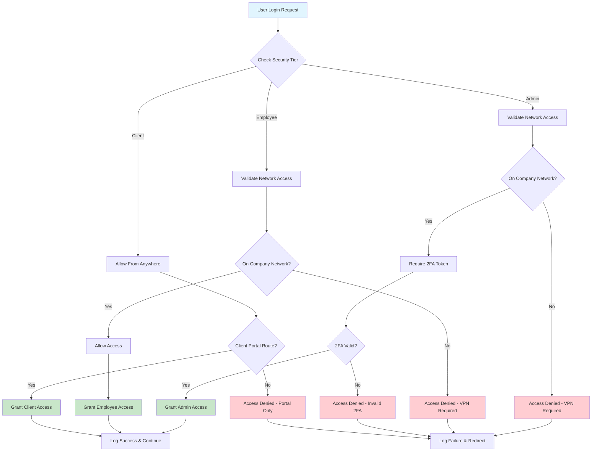

# CRM Security Implementation Guide - Final Version
## Next.js + MongoDB + Company VPN Integration

## Flow Diagram



## Flow Explanation

**Request Processing Flow:**
1. **User Login** → System checks user's security tier (admin/employee/client)
2. **Network Validation** → Verify if user is on company network (VPN/Office) using IP ranges
3. **Security Enforcement:**
   - **Admins**: Must be on company network + provide valid 2FA token
   - **Employees**: Must be on company network (no external access)
   - **Clients**: Can access from anywhere but only client portal routes
4. **Access Decision** → Grant/deny access based on validation results
5. **Audit Logging** → Record all access attempts for security monitoring

## Requirements Summary

1. **Admins**: 2FA on every login + without VPN access
2. **Employees**: Credential-based login + Must be on VPN/Office network
3. **Clients**: Credential-based login + Access from anywhere (client portal only)

---

## Comprehensive Security Architecture

```
Multi-Layered Security Architecture:
┌─────────────────────────────────────────────────────────────┐
│                      Client Layer                           │
│  • Input validation  • XSS protection  • CSRF protection   │
│  • Client-side route protection  • UI access control      │
└─────────────────────────────────────────────────────────────┘
                                │
┌─────────────────────────────────────────────────────────────┐
│                  Network Security Layer                     │
│  • VPN/Office IP validation  • Network access control      │
│  • Geographic restrictions  • Connection monitoring        │
└─────────────────────────────────────────────────────────────┘
                                │
┌─────────────────────────────────────────────────────────────┐
│                   Middleware Layer                          │
│  • Rate limiting  • Request validation  • Security headers │
│  • Security tier enforcement  • Route access control       │
└─────────────────────────────────────────────────────────────┘
                                │
┌─────────────────────────────────────────────────────────────┐
│                Multi-Tier Authentication Layer              │
│  ┌─────────────────┬─────────────────┬─────────────────┐    │
│  │ SUPERADMIN      │    EMPLOYEE     │     CLIENT      │    │
│  │•2FA(TOTP)       │                 │                 |    |
│  │ on every login  │ • Credentials   │ • Credentials   │    │
│  │•VPN not Required│ • VPN Required  │ • Global Access │    │
│  │ • Session mgmt  │ • Session mgmt  │ • Portal only   │    │
│  └─────────────────┴─────────────────┴─────────────────┘    │
└─────────────────────────────────────────────────────────────┘
                                │
┌─────────────────────────────────────────────────────────────┐
│              Dynamic Authorization Layer                    │
│  • RBAC with hierarchy levels  • Dynamic permission eval    │
│  • Context-aware permissions   • Resource-level access      │
│  • Action-based control        • Department constraints     │
│  • Real-time permission cache  • Permission inheritance     │
└─────────────────────────────────────────────────────────────┘
                                │
┌─────────────────────────────────────────────────────────────┐
│                Security Enforcement Layer                   │
│  • Permission validation per request                        │
│  • Security tier + role combination checks                  │
│  • Access attempt logging & monitoring                      │
│  • Failed access lockout & rate limiting                    │
└─────────────────────────────────────────────────────────────┘
                                │
┌─────────────────────────────────────────────────────────────┐
│                   Business Layer                            │
│  • Input sanitization  • Business logic  • Data validation  │
│  • Permission-aware operations  • Audit trail generation    │
└─────────────────────────────────────────────────────────────┘
                                │
┌─────────────────────────────────────────────────────────────┐
│                    Data Layer                               │
│  • Encrypted storage  • Comprehensive audit trails          │
│  • Permission-based queries  • Secure backup systems        │
│  • Data access logging  • Multi-tier data isolation         │
└─────────────────────────────────────────────────────────────┘
```

### Security Layer Interactions

**Layer Integration Flow:**
1. **Client → Network**: UI validates tier access before network requests
2. **Network → Middleware**: IP validation feeds into middleware decisions
3. **Middleware → Auth**: Security tier determines authentication requirements
4. **Auth → Authorization**: User credentials + tier enable permission evaluation
5. **Authorization → Enforcement**: Dynamic permissions checked against security tier
6. **Enforcement → Business**: Validated requests proceed to business logic
7. **Business → Data**: Permission-filtered data operations with audit trails

---

## Architecture Overview

```
Request Flow:
┌─────────────────────────────────────────────────────────┐
│ 1. User Login → NextAuth Credentials Provider           │
│    ├─ Admin: Requires 2FA token (TOTP)                  │
│    ├─ Employee: Username/Password only                  │
│    └─ Client: Username/Password only                    │
├─────────────────────────────────────────────────────────┤
│ 2. Next.js Middleware (runs on every request)           │
│    ├─ Check user security tier from JWT                 │
│    ├─ Validate network location (IP-based)              │
│    ├─ Admin: Allow globally on 2FA verified on every login│
│    ├─ Employee: Allow ONLY if VPN/Office                │
│    └─ Client: Allow from anywhere (portal routes only)  │
├─────────────────────────────────────────────────────────┤
│ 3. Your Existing Middleware (authMiddleware, etc.)      │
│    └─ Role-based permissions continue as normal         │
├─────────────────────────────────────────────────────────┤
│ 4. Application Routes                                   │
└─────────────────────────────────────────────────────────┘
```

---

## 🚀 STEP-BY-STEP IMPLEMENTATION GUIDE

### Phase 1: Foundation Setup

#### Step 1.1: Install Dependencies & Environment Setup

**Action Items:**
1. Install required packages
2. Set up environment variables
3. Create basic utilities

**Implementation:**

## Step 1: Install Dependencies

```bash
npm install speakeasy qrcode
npm install --save-dev @types/speakeasy @types/qrcode
```

---

## Step 2: Database Schema Updates

```typescript
// models/User.ts - Add these fields to your existing User model

import mongoose, { Schema, Document } from 'mongoose'

interface IUser extends Document {
  // ... your existing fields (email, password, role, etc.)
  
  // NEW SECURITY FIELDS
  securityTier: 'admin' | 'employee' | 'client'
  
  twoFactorAuth?: {
    secret: string
    enabled: boolean
    backupCodes: string[]
  }
  
  networkAccess?: {
    lastIP: string
    lastLogin: Date
    failedAttempts: number
    lockedUntil?: Date
  }
}

const userSchema = new Schema<IUser>({
  // ... your existing schema fields ...
  
  // Add these new fields
  securityTier: {
    type: String,
    enum: ['admin', 'employee', 'client'],
    required: true,
    default: 'employee',
    index: true
  },
  
  twoFactorAuth: {
    secret: { type: String, select: false }, // Don't return by default
    enabled: { type: Boolean, default: false },
    backupCodes: [{ type: String, select: false }]
  },
  
  networkAccess: {
    lastIP: String,
    lastLogin: { type: Date, default: Date.now },
    failedAttempts: { type: Number, default: 0 },
    lockedUntil: Date
  }
})

export default mongoose.models.User || mongoose.model<IUser>('User', userSchema)
```

---

## Step 3: Environment Configuration

```bash
# .env.local

# VPN Network Configuration
VPN_IP_RANGES=10.8.0.0/24,172.16.0.0/16
OFFICE_IP_RANGES=192.168.1.0/24,192.168.2.0/24

# Security Settings
MAX_LOGIN_ATTEMPTS=5
LOCKOUT_DURATION_MINUTES=30

# 2FA Configuration
TWO_FACTOR_ISSUER=YourCompany CRM
TWO_FACTOR_WINDOW=1

# NextAuth Configuration
NEXTAUTH_URL=http://localhost:3000
NEXTAUTH_SECRET=your-super-secret-key-here
```

**Important**: Get your actual VPN IP ranges from your IT team. Common VPN ranges:
- WireGuard: 10.8.0.0/24
- OpenVPN: 10.8.0.0/24
- Cisco AnyConnect: 172.16.0.0/16

---

## Step 4: Network Validation Utility

```typescript
// lib/security/network-validator.ts

import { NextRequest } from 'next/server'

export class NetworkValidator {
  private static companyRanges: string[] = [
    ...(process.env.VPN_IP_RANGES?.split(',') || []),
    ...(process.env.OFFICE_IP_RANGES?.split(',') || [])
  ]

  /**
   * Extract real client IP from request headers
   */
  static getClientIP(request: NextRequest): string {
    // Check common proxy headers in order of priority
    const forwarded = request.headers.get('x-forwarded-for')
    const realIP = request.headers.get('x-real-ip')
    const cfConnectingIP = request.headers.get('cf-connecting-ip') // Cloudflare
    
    if (cfConnectingIP) return cfConnectingIP
    if (forwarded) return forwarded.split(',')[0].trim()
    if (realIP) return realIP
    
    return 'unknown'
  }

  /**
   * Check if IP is within company network (VPN or Office)
   */
  static isCompanyNetwork(ip: string): boolean {
    if (ip === 'unknown') return false
    
    return this.companyRanges.some(range => this.ipInCIDR(ip, range))
  }

  /**
   * CIDR notation IP range checker
   * Example: 192.168.1.100 in 192.168.1.0/24 returns true
   */
  private static ipInCIDR(ip: string, cidr: string): boolean {
    // Handle single IP (no CIDR notation)
    if (!cidr.includes('/')) {
      return ip === cidr
    }

    try {
      const [rangeIP, prefixLength] = cidr.split('/')
      const bits = parseInt(prefixLength)
      
      // Convert IPs to 32-bit integers
      const ipInt = this.ipToInt(ip)
      const rangeInt = this.ipToInt(rangeIP)
      
      // Create subnet mask
      const mask = ~(Math.pow(2, 32 - bits) - 1)
      
      // Compare network portions
      return (ipInt & mask) === (rangeInt & mask)
    } catch (error) {
      console.error('CIDR check error:', error)
      return false
    }
  }

  /**
   * Convert IPv4 address to integer
   */
  private static ipToInt(ip: string): number {
    return ip.split('.').reduce((acc, octet) => 
      (acc << 8) + parseInt(octet), 0
    ) >>> 0
  }

  /**
   * Log network access for security audit
   */
  static logAccess(
    email: string, 
    ip: string, 
    allowed: boolean, 
    reason: string
  ): void {
    const timestamp = new Date().toISOString()
    const status = allowed ? 'ALLOWED' : 'DENIED'
    
    console.log(
      `[SECURITY] ${timestamp} | ${status} | ${email} | ${ip} | ${reason}`
    )
  }
}
```

---

## Step 5: Two-Factor Authentication Utility

```typescript
// lib/security/two-factor-auth.ts

import * as speakeasy from 'speakeasy'
import * as QRCode from 'qrcode'

export class TwoFactorAuth {
  /**
   * Generate new 2FA secret for user
   */
  static generateSecret(userEmail: string) {
    const secret = speakeasy.generateSecret({
      name: `${process.env.TWO_FACTOR_ISSUER} (${userEmail})`,
      issuer: process.env.TWO_FACTOR_ISSUER,
      length: 32
    })
    
    return {
      secret: secret.base32!,
      otpauthUrl: secret.otpauth_url!
    }
  }

  /**
   * Generate QR code for authenticator app setup
   */
  static async generateQRCode(otpauthUrl: string): Promise<string> {
    try {
      return await QRCode.toDataURL(otpauthUrl)
    } catch (error) {
      console.error('QR code generation failed:', error)
      throw new Error('Failed to generate QR code')
    }
  }

  /**
   * Verify 2FA token from authenticator app
   */
  static verifyToken(token: string, secret: string): boolean {
    // Remove spaces and validate format
    const cleanToken = token.replace(/\s/g, '')
    
    if (!/^\d{6}$/.test(cleanToken)) {
      return false
    }

    return speakeasy.totp.verify({
      secret,
      encoding: 'base32',
      token: cleanToken,
      window: parseInt(process.env.TWO_FACTOR_WINDOW || '1')
    })
  }

  /**
   * Generate backup codes for emergency access
   */
  static generateBackupCodes(count: number = 8): string[] {
    const codes: string[] = []
    
    for (let i = 0; i < count; i++) {
      // Generate 8-character alphanumeric code
      const code = Array.from({ length: 8 }, () => 
        '0123456789ABCDEFGHJKLMNPQRSTUVWXYZ'[Math.floor(Math.random() * 33)]
      ).join('')
      
      codes.push(code)
    }
    
    return codes
  }

  /**
   * Verify backup code and remove it after use
   */
  static verifyBackupCode(code: string, backupCodes: string[]): boolean {
    const cleanCode = code.replace(/\s/g, '').toUpperCase()
    const index = backupCodes.indexOf(cleanCode)
    
    if (index > -1) {
      backupCodes.splice(index, 1) // Remove used backup code
      return true
    }
    
    return false
  }
}
```

---

## Step 6: NextAuth Configuration

```typescript
// lib/auth.ts (or wherever you configure NextAuth)

import { NextAuthOptions } from 'next-auth'
import CredentialsProvider from 'next-auth/providers/credentials'
import { TwoFactorAuth } from './security/two-factor-auth'
import User from '@/models/User'
import connectDB from './mongodb'

export const authOptions: NextAuthOptions = {
  providers: [
    CredentialsProvider({
      name: 'Credentials',
      credentials: {
        email: { label: "Email", type: "email" },
        password: { label: "Password", type: "password" },
        token2FA: { label: "2FA Code", type: "text" }
      },
      
      async authorize(credentials) {
        if (!credentials?.email || !credentials?.password) {
          throw new Error('Email and password required')
        }

        await connectDB()
        
        // Fetch user with password and 2FA secret
        const user = await User.findOne({ email: credentials.email })
          .select('+password +twoFactorAuth')

        if (!user) {
          throw new Error('Invalid credentials')
        }

        // Check if account is locked
        if (user.networkAccess?.lockedUntil) {
          if (user.networkAccess.lockedUntil > new Date()) {
            const minutesLeft = Math.ceil(
              (user.networkAccess.lockedUntil.getTime() - Date.now()) / 60000
            )
            throw new Error(`Account locked. Try again in ${minutesLeft} minutes`)
          }
        }

        // Verify password (assuming you have comparePassword method)
        const isValidPassword = await user.comparePassword(credentials.password)
        
        if (!isValidPassword) {
          // Increment failed attempts
          user.networkAccess = user.networkAccess || {}
          user.networkAccess.failedAttempts = (user.networkAccess.failedAttempts || 0) + 1
          
          // Lock account after max attempts
          const maxAttempts = parseInt(process.env.MAX_LOGIN_ATTEMPTS || '5')
          if (user.networkAccess.failedAttempts >= maxAttempts) {
            const lockoutMinutes = parseInt(process.env.LOCKOUT_DURATION_MINUTES || '30')
            user.networkAccess.lockedUntil = new Date(Date.now() + lockoutMinutes * 60000)
          }
          
          await user.save()
          throw new Error('Invalid credentials')
        }

        // ADMIN 2FA VERIFICATION (Required on every login)
        if (user.securityTier === 'admin') {
          // Check if 2FA is set up
          if (!user.twoFactorAuth?.enabled) {
            return {
              ...user.toObject(),
              requires2FASetup: true
            }
          }

          // Require 2FA token
          if (!credentials.token2FA) {
            throw new Error('2FA_REQUIRED')
          }

          // Verify 2FA token
          const isValid = TwoFactorAuth.verifyToken(
            credentials.token2FA,
            user.twoFactorAuth.secret
          )

          if (!isValid) {
            user.networkAccess.failedAttempts = (user.networkAccess.failedAttempts || 0) + 1
            await user.save()
            throw new Error('Invalid 2FA code')
          }
        }

        // Successful login - reset failed attempts
        user.networkAccess = {
          ...user.networkAccess,
          failedAttempts: 0,
          lastLogin: new Date(),
          lockedUntil: undefined
        }
        
        await user.save()

        return {
          id: user._id.toString(),
          email: user.email,
          name: user.name,
          securityTier: user.securityTier,
          role: user.role,
          requires2FASetup: false,
          twoFactorVerified: user.securityTier === 'admin'
        }
      }
    })
  ],

  callbacks: {
    async jwt({ token, user }) {
      if (user) {
        token.id = user.id
        token.securityTier = user.securityTier
        token.role = user.role
        token.requires2FASetup = user.requires2FASetup
        token.twoFactorVerified = user.twoFactorVerified || false
      }
      return token
    },

    async session({ session, token }) {
      if (session.user) {
        session.user.id = token.id as string
        session.user.securityTier = token.securityTier as string
        session.user.role = token.role
        session.user.twoFactorVerified = token.twoFactorVerified as boolean
      }
      return session
    }
  },

  pages: {
    signIn: '/auth/login',
    error: '/auth/error'
  },

  session: {
    strategy: 'jwt',
    maxAge: 24 * 60 * 60 // 24 hours
  }
}
```

---

## Step 7: Security Middleware (Core Protection Layer)

```typescript
// middleware.ts (root level)

import { NextRequest, NextResponse } from 'next/server'
import { getToken } from 'next-auth/jwt'
import { NetworkValidator } from '@/lib/security/network-validator'

export async function middleware(request: NextRequest) {
  const { pathname } = request.nextUrl

  // Skip security for public routes
  const publicPaths = [
    '/auth/login',
    '/auth/register',
    '/auth/2fa-setup',
    '/auth/access-denied',
    '/client-portal/login',
    '/api/auth',
    '/_next',
    '/favicon.ico',
    '/public'
  ]

  if (publicPaths.some(path => pathname.startsWith(path))) {
    return NextResponse.next()
  }

  // Get user from JWT token
  const token = await getToken({ 
    req: request,
    secret: process.env.NEXTAUTH_SECRET 
  })

  if (!token?.email) {
    return NextResponse.redirect(new URL('/auth/login', request.url))
  }

  // Get client IP
  const clientIP = NetworkValidator.getClientIP(request)
  const isCompanyNetwork = NetworkValidator.isCompanyNetwork(clientIP)
  const userTier = token.securityTier as string

  // TIER-BASED NETWORK VALIDATION
  
  // ADMIN: Must be on company network OR have 2FA verified
  if (userTier === 'admin') {
    if (!isCompanyNetwork) {
      NetworkValidator.logAccess(
        token.email as string,
        clientIP,
        false,
        'Admin attempted access from outside company network'
      )
      
      return redirectToAccessDenied(
        request,
        'admin_network_required',
        'Admins must connect via company VPN or be in office'
      )
    }

    // Check if 2FA was verified during login
    if (!token.twoFactorVerified) {
      return NextResponse.redirect(new URL('/auth/login?reason=2fa_required', request.url))
    }
  }

  // EMPLOYEE: MUST be on company network (VPN or Office)
  if (userTier === 'employee') {
    if (!isCompanyNetwork) {
      NetworkValidator.logAccess(
        token.email as string,
        clientIP,
        false,
        'Employee attempted access from outside company network'
      )
      
      return redirectToAccessDenied(
        request,
        'employee_network_required',
        'Employees must connect via company VPN or be in office'
      )
    }
  }

  // CLIENT: Can access from anywhere BUT only client portal
  if (userTier === 'client') {
    if (!pathname.startsWith('/client-portal')) {
      NetworkValidator.logAccess(
        token.email as string,
        clientIP,
        false,
        'Client attempted to access non-portal routes'
      )
      
      return redirectToAccessDenied(
        request,
        'client_portal_only',
        'Clients can only access the client portal'
      )
    }
  }

  // Success - log and continue
  NetworkValidator.logAccess(
    token.email as string,
    clientIP,
    true,
    `${userTier} access granted`
  )

  // Add security headers
  const response = NextResponse.next()
  response.headers.set('X-Content-Type-Options', 'nosniff')
  response.headers.set('X-Frame-Options', 'DENY')
  response.headers.set('X-XSS-Protection', '1; mode=block')
  response.headers.set('Referrer-Policy', 'strict-origin-when-cross-origin')
  
  return response
}

function redirectToAccessDenied(
  request: NextRequest,
  reason: string,
  message: string
) {
  const url = new URL('/auth/access-denied', request.url)
  url.searchParams.set('reason', reason)
  url.searchParams.set('message', message)
  return NextResponse.redirect(url)
}

export const config = {
  matcher: [
    '/((?!_next/static|_next/image|favicon.ico|public).*)',
  ]
}
```

---

## Step 8: Login Page with 2FA

```typescript
// app/auth/login/page.tsx

'use client'

import { useState, useEffect } from 'react'
import { signIn } from 'next-auth/react'
import { useRouter, useSearchParams } from 'next/navigation'

export default function LoginPage() {
  const [email, setEmail] = useState('')
  const [password, setPassword] = useState('')
  const [token2FA, setToken2FA] = useState('')
  const [showAdmin2FA, setShowAdmin2FA] = useState(false)
  const [loading, setLoading] = useState(false)
  const [error, setError] = useState('')
  
  const router = useRouter()
  const searchParams = useSearchParams()

  useEffect(() => {
    const reason = searchParams.get('reason')
    if (reason === '2fa_required') {
      setError('2FA verification required for admin access')
    }
  }, [searchParams])

  const handleSubmit = async (e: React.FormEvent) => {
    e.preventDefault()
    setError('')
    setLoading(true)

    try {
      const result = await signIn('credentials', {
        email,
        password,
        token2FA: showAdmin2FA ? token2FA : undefined,
        redirect: false
      })

      if (result?.error) {
        if (result.error === '2FA_REQUIRED') {
          setShowAdmin2FA(true)
          setError('Please enter your 2FA code from authenticator app')
        } else {
          setError(result.error)
        }
      } else if (result?.ok) {
        router.push('/dashboard')
        router.refresh()
      }
    } catch (err: any) {
      setError(err.message || 'Login failed')
    } finally {
      setLoading(false)
    }
  }

  return (
    <div className="min-h-screen flex items-center justify-center bg-gray-50 py-12 px-4">
      <div className="max-w-md w-full space-y-8">
        <div>
          <h2 className="mt-6 text-center text-3xl font-extrabold text-gray-900">
            Sign in to CRM
          </h2>
          {showAdmin2FA && (
            <p className="mt-2 text-center text-sm text-blue-600">
              Admin 2FA Required - Enter code from authenticator app
            </p>
          )}
        </div>

        {error && (
          <div className="rounded-md bg-red-50 p-4">
            <p className="text-sm text-red-800">{error}</p>
          </div>
        )}

        <form className="mt-8 space-y-6" onSubmit={handleSubmit}>
          <div className="rounded-md shadow-sm -space-y-px">
            <div>
              <label htmlFor="email" className="sr-only">Email</label>
              <input
                id="email"
                name="email"
                type="email"
                required
                disabled={showAdmin2FA}
                className="appearance-none rounded-none relative block w-full px-3 py-2 border border-gray-300 placeholder-gray-500 text-gray-900 rounded-t-md focus:outline-none focus:ring-blue-500 focus:border-blue-500 focus:z-10 sm:text-sm"
                placeholder="Email address"
                value={email}
                onChange={(e) => setEmail(e.target.value)}
              />
            </div>
            <div>
              <label htmlFor="password" className="sr-only">Password</label>
              <input
                id="password"
                name="password"
                type="password"
                required
                disabled={showAdmin2FA}
                className="appearance-none rounded-none relative block w-full px-3 py-2 border border-gray-300 placeholder-gray-500 text-gray-900 rounded-b-md focus:outline-none focus:ring-blue-500 focus:border-blue-500 focus:z-10 sm:text-sm"
                placeholder="Password"
                value={password}
                onChange={(e) => setPassword(e.target.value)}
              />
            </div>
          </div>

          {showAdmin2FA && (
            <div>
              <label htmlFor="token2fa" className="sr-only">2FA Code</label>
              <input
                id="token2fa"
                name="token2fa"
                type="text"
                required
                maxLength={6}
                className="appearance-none relative block w-full px-3 py-2 border border-gray-300 placeholder-gray-500 text-gray-900 rounded-md focus:outline-none focus:ring-blue-500 focus:border-blue-500 text-center text-2xl tracking-widest"
                placeholder="000000"
                value={token2FA}
                onChange={(e) => setToken2FA(e.target.value.replace(/\D/g, ''))}
              />
            </div>
          )}

          <div>
            <button
              type="submit"
              disabled={loading}
              className="group relative w-full flex justify-center py-2 px-4 border border-transparent text-sm font-medium rounded-md text-white bg-blue-600 hover:bg-blue-700 focus:outline-none focus:ring-2 focus:ring-offset-2 focus:ring-blue-500 disabled:opacity-50"
            >
              {loading ? 'Signing in...' : showAdmin2FA ? 'Verify & Sign in' : 'Sign in'}
            </button>
          </div>
        </form>
      </div>
    </div>
  )
}
```

---

## Step 9: Access Denied Page

```typescript
// app/auth/access-denied/page.tsx

'use client'

import { useSearchParams } from 'next/navigation'
import { useEffect, useState } from 'react'

export default function AccessDeniedPage() {
  const searchParams = useSearchParams()
  const [currentIP, setCurrentIP] = useState('Loading...')
  
  const reason = searchParams.get('reason') || 'unknown'
  const message = searchParams.get('message') || 'Access denied'

  useEffect(() => {
    fetch('/api/network/check-ip')
      .then(res => res.json())
      .then(data => setCurrentIP(data.ip))
      .catch(() => setCurrentIP('Unable to detect'))
  }, [])

  const reasonDetails = {
    admin_network_required: {
      title: 'VPN Connection Required',
      instructions: 'As an admin, you must connect via company VPN or be in the office to access the CRM.',
      steps: [
        'Connect to company VPN',
        'Verify your VPN connection is active',
        'Refresh this page or try logging in again'
      ]
    },
    employee_network_required: {
      title: 'Company Network Required',
      instructions: 'Employees must be connected to the company network (VPN or office) to access the CRM.',
      steps: [
        'Connect to company VPN',
        'Or connect to office WiFi',
        'Refresh this page after connecting'
      ]
    },
    client_portal_only: {
      title: 'Client Portal Access Only',
      instructions: 'Client accounts can only access the client portal.',
      steps: [
        'Go to Client Portal',
        'Contact support if you need different access'
      ]
    }
  }

  const details = reasonDetails[reason as keyof typeof reasonDetails] || {
    title: 'Access Denied',
    instructions: message,
    steps: ['Contact your administrator for assistance']
  }

  return (
    <div className="min-h-screen flex items-center justify-center bg-gray-50 py-12 px-4">
      <div className="max-w-md w-full space-y-8 bg-white p-8 rounded-lg shadow-lg">
        <div className="text-center">
          <div className="mx-auto h-12 w-12 text-red-600">
            <svg fill="none" viewBox="0 0 24 24" stroke="currentColor">
              <path strokeLinecap="round" strokeLinejoin="round" strokeWidth={2} d="M12 9v2m0 4h.01m-6.938 4h13.856c1.54 0 2.502-1.667 1.732-3L13.732 4c-.77-1.333-2.694-1.333-3.464 0L3.34 16c-.77 1.333.192 3 1.732 3z" />
            </svg>
          </div>
          <h2 className="mt-6 text-3xl font-extrabold text-gray-900">
            {details.title}
          </h2>
          <p className="mt-2 text-sm text-gray-600">
            {details.instructions}
          </p>
        </div>

        <div className="mt-8 space-y-6">
          <div className="bg-blue-50 p-4 rounded-md">
            <h3 className="text-sm font-medium text-blue-800 mb-2">
              Your Current IP:
            </h3>
            <p className="text-sm text-blue-700 font-mono">{currentIP}</p>
          </div>

          <div className="bg-gray-50 p-4 rounded-md">
            <h3 className="text-sm font-medium text-gray-900 mb-2">
              Next Steps:
            </h3>
            <ol className="list-decimal list-inside space-y-1 text-sm text-gray-600">
              {details.steps.map((step, index) => (
                <li key={index}>{step}</li>
              ))}
            </ol>
          </div>

          <div className="flex flex-col space-y-2">
            <button
              onClick={() => window.location.href = '/auth/login'}
              className="w-full flex justify-center py-2 px-4 border border-transparent rounded-md shadow-sm text-sm font-medium text-white bg-blue-600 hover:bg-blue-700"
            >
              Try Again
            </button>
            <a
              href="mailto:it@yourcompany.com"
              className="w-full flex justify-center py-2 px-4 border border-gray-300 rounded-md shadow-sm text-sm font-medium text-gray-700 bg-white hover:bg-gray-50"
            >
              Contact IT Support
            </a>
          </div>
        </div>
      </div>
    </div>
  )
}
```

---

## Step 10: IP Check API Route

```typescript
// app/api/network/check-ip/route.ts

import { NextRequest, NextResponse } from 'next/server'
import { NetworkValidator } from '@/lib/security/network-validator'

export async function GET(request: NextRequest) {
  const clientIP = NetworkValidator.getClientIP(request)
  const isCompanyNetwork = NetworkValidator.isCompanyNetwork(clientIP)
  
  return NextResponse.json({
    ip: clientIP,
    isCompanyNetwork,
    companyRanges: [
      ...(process.env.VPN_IP_RANGES?.split(',') || []),
      ...(process.env.OFFICE_IP_RANGES?.split(',') || [])
    ]
  })
}
```

---

## Step 11: Admin 2FA Setup Page

```typescript
// app/admin/2fa-setup/page.tsx

'use client'

import { useState, useEffect } from 'react'
import { useSession } from 'next-auth/react'
import { useRouter } from 'next/navigation'

export default function Setup2FAPage() {
  const { data: session } = useSession()
  const router = useRouter()
  
  const [qrCode, setQrCode] = useState('')
  const [secret, setSecret] = useState('')
  const [backupCodes, setBackupCodes] = useState<string[]>([])
  const [verificationToken, setVerificationToken] = useState('')
  const [step, setStep] = useState<'generate' | 'verify' | 'complete'>('generate')
  const [loading, setLoading] = useState(false)
  const [error, setError] = useState('')

  // Redirect non-admins
  useEffect(() => {
    if (session && session.user.securityTier !== 'admin') {
      router.push('/dashboard')
    }
  }, [session, router])

  const generateSecret = async () => {
    setLoading(true)
    setError('')

    try {
      const response = await fetch('/api/admin/2fa/generate', {
        method: 'POST'
      })

      if (!response.ok) {
        throw new Error('Failed to generate 2FA secret')
      }

      const data = await response.json()
      setQrCode(data.qrCode)
      setSecret(data.secret)
      setBackupCodes(data.backupCodes)
      setStep('verify')
    } catch (err: any) {
      setError(err.message)
    } finally {
      setLoading(false)
    }
  }

  const verify2FA = async () => {
    setLoading(true)
    setError('')

    try {
      const response = await fetch('/api/admin/2fa/verify-setup', {
        method: 'POST',
        headers: { 'Content-Type': 'application/json' },
        body: JSON.stringify({ token: verificationToken })
      })

      if (!response.ok) {
        const data = await response.json()
        throw new Error(data.error || 'Verification failed')
      }

      setStep('complete')
    } catch (err: any) {
      setError(err.message)
    } finally {
      setLoading(false)
    }
  }

  const downloadBackupCodes = () => {
    const text = backupCodes.join('\n')
    const blob = new Blob([text], { type: 'text/plain' })
    const url = URL.createObjectURL(blob)
    const a = document.createElement('a')
    a.href = url
    a.download = 'crm-backup-codes.txt'
    a.click()
  }

  if (step === 'generate') {
    return (
      <div className="min-h-screen flex items-center justify-center bg-gray-50 py-12 px-4">
        <div className="max-w-md w-full bg-white p-8 rounded-lg shadow-lg">
          <h2 className="text-2xl font-bold text-gray-900 mb-4">
            Set Up Two-Factor Authentication
          </h2>
          <p className="text-gray-600 mb-6">
            As an admin, you're required to enable 2FA for enhanced security. 
            You'll need a mobile authenticator app like Google Authenticator or Microsoft Authenticator.
          </p>

          {error && (
            <div className="mb-4 p-3 bg-red-50 text-red-700 rounded">
              {error}
            </div>
          )}

          <button
            onClick={generateSecret}
            disabled={loading}
            className="w-full bg-blue-600 text-white py-2 px-4 rounded hover:bg-blue-700 disabled:opacity-50"
          >
            {loading ? 'Generating...' : 'Generate 2FA Secret'}
          </button>
        </div>
      </div>
    )
  }

  if (step === 'verify') {
    return (
      <div className="min-h-screen flex items-center justify-center bg-gray-50 py-12 px-4">
        <div className="max-w-md w-full bg-white p-8 rounded-lg shadow-lg">
          <h2 className="text-2xl font-bold text-gray-900 mb-4">
            Scan QR Code
          </h2>
          
          <div className="mb-6">
            <p className="text-gray-600 mb-4">
              1. Open your authenticator app
            </p>
            <p className="text-gray-600 mb-4">
              2. Scan this QR code:
            </p>
            
            <div className="flex justify-center mb-4">
              {qrCode && }
            </div>

            <p className="text-sm text-gray-500 mb-2">
              Or enter this code manually:
            </p>
            <div className="bg-gray-100 p-3 rounded font-mono text-sm break-all">
              {secret}
            </div>
          </div>

          {error && (
            <div className="mb-4 p-3 bg-red-50 text-red-700 rounded">
              {error}
            </div>
          )}

          <div className="mb-4">
            <label className="block text-sm font-medium text-gray-700 mb-2">
              Enter verification code from your app:
            </label>
            <input
              type="text"
              maxLength={6}
              value={verificationToken}
              onChange={(e) => setVerificationToken(e.target.value.replace(/\D/g, ''))}
              className="w-full px-3 py-2 border border-gray-300 rounded text-center text-2xl tracking-widest"
              placeholder="000000"
            />
          </div>

          <button
            onClick={verify2FA}
            disabled={loading || verificationToken.length !== 6}
            className="w-full bg-blue-600 text-white py-2 px-4 rounded hover:bg-blue-700 disabled:opacity-50"
          >
            {loading ? 'Verifying...' : 'Verify & Enable 2FA'}
          </button>
        </div>
      </div>
    )
  }

  return (
    <div className="min-h-screen flex items-center justify-center bg-gray-50 py-12 px-4">
      <div className="max-w-md w-full bg-white p-8 rounded-lg shadow-lg">
        <div className="text-center mb-6">
          <div className="mx-auto h-12 w-12 text-green-600 mb-4">
            <svg fill="none" viewBox="0 0 24 24" stroke="currentColor">
              <path strokeLinecap="round" strokeLinejoin="round" strokeWidth={2} d="M9 12l2 2 4-4m6 2a9 9 0 11-18 0 9 9 0 0118 0z" />
            </svg>
          </div>
          <h2 className="text-2xl font-bold text-gray-900">
            2FA Enabled Successfully!
          </h2>
        </div>

        <div className="bg-yellow-50 border border-yellow-200 rounded p-4 mb-6">
          <h3 className="font-medium text-yellow-900 mb-2">
            Save Your Backup Codes
          </h3>
          <p className="text-sm text-yellow-800 mb-4">
            Store these codes in a safe place. You can use them to access your account if you lose your phone.
          </p>
          
          <div className="bg-white p-3 rounded mb-4 font-mono text-sm">
            {backupCodes.map((code, index) => (
              <div key={index} className="py-1">{code}</div>
            ))}
          </div>

          <button
            onClick={downloadBackupCodes}
            className="w-full bg-yellow-600 text-white py-2 px-4 rounded hover:bg-yellow-700"
          >
            Download Backup Codes
          </button>
        </div>

        <button
          onClick={() => router.push('/dashboard')}
          className="w-full bg-blue-600 text-white py-2 px-4 rounded hover:bg-blue-700"
        >
          Go to Dashboard
        </button>
      </div>
    </div>
  )
}
```

---

## Step 12: 2FA API Routes

```typescript
// app/api/admin/2fa/generate/route.ts

import { NextRequest, NextResponse } from 'next/server'
import { getServerSession } from 'next-auth'
import { authOptions } from '@/lib/auth'
import { TwoFactorAuth } from '@/lib/security/two-factor-auth'
import User from '@/models/User'
import connectDB from '@/lib/mongodb'

export async function POST(request: NextRequest) {
  try {
    const session = await getServerSession(authOptions)
    
    if (!session?.user?.email) {
      return NextResponse.json({ error: 'Unauthorized' }, { status: 401 })
    }

    await connectDB()
    
    const user = await User.findOne({ email: session.user.email })

    if (!user || user.securityTier !== 'admin') {
      return NextResponse.json({ error: 'Admin access required' }, { status: 403 })
    }

    // Generate 2FA secret
    const { secret, otpauthUrl } = TwoFactorAuth.generateSecret(user.email)
    const qrCode = await TwoFactorAuth.generateQRCode(otpauthUrl)
    const backupCodes = TwoFactorAuth.generateBackupCodes()

    // Store secret temporarily (will be confirmed after verification)
    user.twoFactorAuth = {
      secret,
      enabled: false, // Not enabled until verified
      backupCodes
    }
    
    await user.save()

    return NextResponse.json({
      qrCode,
      secret,
      backupCodes
    })
  } catch (error) {
    console.error('2FA generation error:', error)
    return NextResponse.json({ error: 'Failed to generate 2FA' }, { status: 500 })
  }
}
```

```typescript
// app/api/admin/2fa/verify-setup/route.ts

import { NextRequest, NextResponse } from 'next/server'
import { getServerSession } from 'next-auth'
import { authOptions } from '@/lib/auth'
import { TwoFactorAuth } from '@/lib/security/two-factor-auth'
import User from '@/models/User'
import connectDB from '@/lib/mongodb'

export async function POST(request: NextRequest) {
  try {
    const session = await getServerSession(authOptions)
    const { token } = await request.json()
    
    if (!session?.user?.email) {
      return NextResponse.json({ error: 'Unauthorized' }, { status: 401 })
    }

    if (!token || token.length !== 6) {
      return NextResponse.json({ error: 'Invalid token format' }, { status: 400 })
    }

    await connectDB()
    
    const user = await User.findOne({ email: session.user.email })
      .select('+twoFactorAuth')

    if (!user || user.securityTier !== 'admin') {
      return NextResponse.json({ error: 'Admin access required' }, { status: 403 })
    }

    if (!user.twoFactorAuth?.secret) {
      return NextResponse.json({ error: '2FA not initialized' }, { status: 400 })
    }

    // Verify token
    const isValid = TwoFactorAuth.verifyToken(token, user.twoFactorAuth.secret)

    if (!isValid) {
      return NextResponse.json({ error: 'Invalid verification code' }, { status: 400 })
    }

    // Enable 2FA
    user.twoFactorAuth.enabled = true
    await user.save()

    return NextResponse.json({ success: true })
  } catch (error) {
    console.error('2FA verification error:', error)
    return NextResponse.json({ error: 'Verification failed' }, { status: 500 })
  }
}
```

---

## Testing Guide

### Local Testing Setup

```bash
# 1. Run migration script
npx ts-node scripts/setup-security-tiers.ts

# 2. Start development server
npm run dev

# 3. Test each tier
```

### Test Cases

**Test 1: Admin Login with 2FA**
```bash
# Expected: Admin must enter 2FA code from authenticator app
# Location: Office or VPN
# Result: Should succeed with valid 2FA
```

**Test 2: Employee from Office**
```bash
# Expected: Login with credentials only
# Location: Office IP (192.168.x.x)
# Result: Should succeed
```

**Test 3: Employee from Home (Should Fail)**
```bash
# Expected: Access denied
# Location: External IP
# Result: Should show "Company network required" error
```

**Test 4: Client from Anywhere**
```bash
# Expected: Login with credentials
# Location: Any IP
# Route: /client-portal only
# Result: Should succeed
```

### Testing Network Detection Locally

```typescript
// Create test file: scripts/test-network.ts

import { NetworkValidator } from '@/lib/security/network-validator'

const testIPs = [
  '192.168.1.100',  // Office
  '10.8.0.5',       // VPN
  '8.8.8.8',        // External (Google DNS)
  '203.0.113.45'    // External
]

console.log('Network Validation Tests:\n')

testIPs.forEach(ip => {
  const isCompany = NetworkValidator.isCompanyNetwork(ip)
  console.log(`${ip}: ${isCompany ? '✅ ALLOWED' : '❌ BLOCKED'}`)
})
```

Run: `npx ts-node scripts/test-network.ts`

---

## Deployment Checklist

### Pre-Deployment

- [ ] Get actual VPN IP ranges from IT team
- [ ] Get office IP ranges
- [ ] Update `.env.local` with correct IP ranges
- [ ] Run security tier migration
- [ ] Test all three user tiers locally
- [ ] Verify 2FA setup works for admins
- [ ] Test network detection accuracy

### Production Deployment

- [ ] Set environment variables in production
- [ ] Deploy code to production
- [ ] Run migration script on production database
- [ ] Have all admins set up 2FA immediately
- [ ] Test login from office
- [ ] Test login from VPN
- [ ] Monitor security logs for first 24 hours

### Post-Deployment

- [ ] Send email to all users about new security requirements
- [ ] Create documentation for VPN connection
- [ ] Set up monitoring alerts for failed access attempts
- [ ] Schedule weekly security log reviews

---

## Security Monitoring

### Viewing Access Logs

```typescript
// Create admin endpoint: app/api/admin/security-logs/route.ts

import { NextRequest, NextResponse } from 'next/server'
import { getServerSession } from 'next-auth'
import { authOptions } from '@/lib/auth'
import User from '@/models/User'
import connectDB from '@/lib/mongodb'

export async function GET(request: NextRequest) {
  const session = await getServerSession(authOptions)
  
  if (!session || session.user.securityTier !== 'admin') {
    return NextResponse.json({ error: 'Admin access required' }, { status: 403 })
  }

  await connectDB()

  // Get users with failed access attempts
  const suspiciousActivity = await User.find({
    'networkAccess.failedAttempts': { $gt: 0 }
  })
  .select('email securityTier networkAccess')
  .sort({ 'networkAccess.lastLogin': -1 })
  .limit(50)

  return NextResponse.json({ logs: suspiciousActivity })
}
```

### Alert Configuration

Add to environment:
```bash
# Email alerts for security events
SECURITY_ALERT_EMAIL=security@yourcompany.com
```

Implement in middleware:
```typescript
// Add to NetworkValidator class
static async sendSecurityAlert(
  email: string,
  ip: string,
  reason: string
) {
  // Send email notification for suspicious activity
  // Implement using your email service
}
```

---

## Troubleshooting

### Issue 1: IP Detection Shows "unknown"

**Cause**: Reverse proxy not forwarding IP headers

**Solution**:
```nginx
# Add to nginx configuration
proxy_set_header X-Forwarded-For $proxy_add_x_forwarded_for;
proxy_set_header X-Real-IP $remote_addr;
```

### Issue 2: Employee Can't Access from Office

**Cause**: Office IP not in whitelist

**Solution**:
1. Check employee's actual IP: Visit `/api/network/check-ip`
2. Add IP range to `OFFICE_IP_RANGES` in `.env`
3. Restart application

### Issue 3: Admin 2FA Not Working

**Cause**: Time sync issue between server and authenticator app

**Solution**:
1. Ensure server time is synced (NTP)
2. Increase `TWO_FACTOR_WINDOW` to 2 in `.env`
3. Regenerate 2FA secret

### Issue 4: Client Can Access Admin Routes

**Cause**: Middleware not catching route

**Solution**:
```typescript
// Ensure middleware config includes all routes
export const config = {
  matcher: [
    '/((?!_next/static|_next/image|favicon.ico|public).*)',
  ]
}
```

---

## Maintenance Tasks

### Weekly

- [ ] Review security logs
- [ ] Check for locked accounts
- [ ] Verify IP ranges are current

### Monthly

- [ ] Audit user security tiers
- [ ] Review failed login attempts
- [ ] Update VPN IP ranges if changed
- [ ] Test 2FA backup codes

### Quarterly

- [ ] Full security audit
- [ ] Update dependencies
- [ ] Review and update documentation
- [ ] Disaster recovery drill

---

## Cost Breakdown

**Infrastructure**: $0/month
- No additional services needed
- Uses existing VPN infrastructure
- TOTP is free (client-side apps)

**Development Time**: 3-4 days
- Database setup: 4 hours
- Network validation: 4 hours
- 2FA implementation: 6 hours
- UI components: 8 hours
- Testing: 6 hours

**Maintenance**: ~4 hours/month
- Log monitoring: 2 hours
- IP range updates: 1 hour
- User support: 1 hour

---

## Migration from Development to Production

### Phase 1: Preparation (Week 1)

**Day 1-2**: Development & Testing
- Implement all code
- Test locally
- Get IT team sign-off on IP ranges

**Day 3-4**: Staging Deployment
- Deploy to staging environment
- Full integration testing
- Load testing

**Day 5**: Documentation
- Create user guides
- VPN connection instructions
- 2FA setup guide

### Phase 2: Rollout (Week 2)

**Monday**: Admin Rollout
- Deploy to production
- Enable for admins only
- Admins set up 2FA
- Monitor for issues

**Tuesday-Wednesday**: Employee Testing
- Enable for test group of employees
- Verify VPN detection works
- Gather feedback
- Fix any issues

**Thursday**: Full Employee Rollout
- Enable for all employees
- Monitor access logs
- Provide IT support

**Friday**: Client Portal
- Enable client access
- Verify isolation works
- Monitor client activity

### Phase 3: Stabilization (Week 3)

- Daily log monitoring
- Quick bug fixes
- User training sessions
- Documentation updates

---

## Security Best Practices

### 1. IP Range Management

**DO:**
- Use CIDR notation for ranges
- Document all IP ranges
- Regular audits of allowed IPs
- Version control for IP configs

**DON'T:**
- Hardcode IPs in code
- Allow entire ISP ranges
- Forget to remove old ranges
- Share IP configs publicly

### 2. 2FA Management

**DO:**
- Enforce 2FA for all admins
- Provide backup codes
- Regular 2FA audits
- Keep backup codes secure

**DON'T:**
- Allow 2FA disable without verification
- Use SMS-based 2FA
- Store secrets in plain text
- Share 2FA secrets

### 3. Access Logging

**DO:**
- Log all access attempts
- Monitor failed attempts
- Alert on suspicious activity
- Regular log reviews

**DON'T:**
- Log sensitive data (passwords)
- Keep logs forever
- Ignore failed attempts
- Skip log analysis

---

## FAQ

**Q: Can employees work remotely?**
A: Yes, if they connect via company VPN first.

**Q: What if an admin loses their phone?**
A: Use backup codes to login, then regenerate 2FA.

**Q: Can we add more IP ranges later?**
A: Yes, just update environment variables and restart.

**Q: How long do sessions last?**
A: 24 hours max, but middleware checks network on every request.

**Q: What happens if VPN goes down?**
A: Employees can't work. Admins can if they're in office.

**Q: Can clients access admin features?**
A: No, clients are restricted to /client-portal routes only.

**Q: How do we handle new hires?**
A: Create user with appropriate securityTier during onboarding.

**Q: What about mobile access?**
A: Mobile users must use VPN, same as desktop.

---

## Summary

This implementation provides:

✅ **Admin Security**
- 2FA required on every login (TOTP)
- Network access via VPN or office
- Can work remotely with VPN

✅ **Employee Security**
- Credential-based login
- MUST be on VPN or in office
- Cannot access from external networks

✅ **Client Security**
- Credential-based login
- Global access from anywhere
- Isolated to client portal routes

✅ **Technical Benefits**
- Simple, maintainable code
- No external dependencies
- Works with existing role system
- Easy to monitor and audit
- Zero ongoing costs

✅ **Future-Proof**
- Standard security patterns
- Easy to extend
- Clear documentation
- Professional implementation

---

## Next Steps

1. **Get VPN IP ranges from IT team**
2. **Install dependencies**: `npm install speakeasy qrcode`
3. **Update environment variables** with actual IP ranges
4. **Run migration script** to assign security tiers
5. **Deploy to staging** and test thoroughly
6. **Train admins** on 2FA setup
7. **Deploy to production** following rollout plan
8. **Monitor security logs** for first week

---

## Support

For questions or issues:
- Security concerns: security@yourcompany.com
- Technical issues: it@yourcompany.com
- VPN access: vpn-support@yourcompany.com

---

**Implementation Version**: 1.0  
**Last Updated**: 2024  
**Maintained By**: Development Team

```typescript
// scripts/setup-security-tiers.ts

import connectDB from '@/lib/mongodb'
import User from '@/models/User'

async function setupSecurityTiers() {
  try {
    await connectDB()
    console.log('🔒 Setting up security tiers...\n')

    // Get all users
    const users = await User.find({}).populate('role')
    
    let adminCount = 0
    let employeeCount = 0
    let clientCount = 0

    for (const user of users) {
      let securityTier: 'admin' | 'employee' | 'client' = 'employee'

      // Determine tier based on your existing role system
      if (user.role) {
        const roleName = user.role.name?.toLowerCase() || ''
        const hierarchyLevel = user.role.hierarchyLevel || 0

        // Admins: High hierarchy level or specific role names
        if (hierarchyLevel >= 9 || roleName.includes('admin') || roleName.includes('ceo') || roleName.includes('director')) {
          securityTier = 'admin'
          adminCount++
        }
        // Clients: Role name contains 'client'
        else if (roleName.includes('client')) {
          securityTier = 'client'
          clientCount++
        }
        // Everyone else: Employee
        else {
          securityTier = 'employee'
          employeeCount++
        }
      }

      // Update user with security tier
      await User.updateOne(
        { _id: user._id },
        {
          $set: {
            securityTier,
            'twoFactorAuth.enabled': securityTier === 'admin' ? false : undefined,
            'networkAccess.failedAttempts': 0,
            'networkAccess.lastLogin': new Date()
          }
        }
      )

      console.log(`✅ ${user.email}: ${securityTier}`)
    }

    console.log('\n📊 Summary:')
    console.log(`   Admins: ${adminCount}`)
    console.log(`   Employees: ${employeeCount}`)
    console.log(`   Clients: ${clientCount}`)
    console.log(`   Total: ${users.length}`)
    console.log('\n🎉 Security tier setup complete!')
    console.log('\n⚠️  Next steps:')
    console.log('   1. Have all admins set up 2FA at /admin/2fa-setup')
    console.log('   2. Configure VPN IP ranges in .env.local')
    console.log('   3. Test login for each user tier')

    process.exit(0)
  } catch (error) {
    console.error('❌ Migration failed:', error)
    process.exit(1)
  }
}

setupSecurityTiers()

---

## 🔥 COMPLETE STEP-BY-STEP IMPLEMENTATION MODULE

### 📋 Implementation Phases Overview

**Phase 1**: Foundation & Database Setup (Day 1)
**Phase 2**: Network Security Layer (Day 2)
**Phase 3**: 2FA Implementation (Day 3)
**Phase 4**: Middleware Integration (Day 4)
**Phase 5**: Testing & Deployment (Day 5)

---

## 📦 PHASE 1: FOUNDATION SETUP

### Module 1.1: Dependencies & Environment

**🎯 Goal**: Set up project dependencies and environment configuration

**⏱️ Time**: 30 minutes

**📝 Steps:**

1. **Install Security Dependencies**
```bash
npm install speakeasy qrcode
npm install --save-dev @types/speakeasy @types/qrcode
```

2. **Create Environment File**
```bash
# Copy from .env.local.example or create new
cp .env.local.example .env.local
```

3. **Add Security Configuration**
```env
# Add to .env.local
VPN_IP_RANGES=10.8.0.0/24,172.16.0.0/16
OFFICE_IP_RANGES=192.168.1.0/24,192.168.2.0/24
MAX_LOGIN_ATTEMPTS=5
LOCKOUT_DURATION_MINUTES=30
TWO_FACTOR_ISSUER=DepLLC CRM
TWO_FACTOR_WINDOW=1
```

**🧪 Testing Module 1.1:**
```bash
# Verify installation
npm list speakeasy qrcode

# Check environment
node -e "console.log('VPN_IP_RANGES:', process.env.VPN_IP_RANGES)"
```

**✅ Success Criteria:**
- Dependencies installed without errors
- Environment variables loaded correctly
- No TypeScript compilation errors

---

### Module 1.2: Database Schema Update

**🎯 Goal**: Update User model with security fields

**⏱️ Time**: 45 minutes

**📝 Steps:**

1. **Backup Current User Model**
```bash
cp models/User.ts models/User.ts.backup
```

2. **Update User Schema** (Add to your existing User model)
```typescript
// Add these interfaces and fields to your existing models/User.ts

interface ISecurityTier {
  securityTier: 'admin' | 'employee' | 'client'
  
  twoFactorAuth?: {
    secret: string
    enabled: boolean
    backupCodes: string[]
  }
  
  networkAccess?: {
    lastIP: string
    lastLogin: Date
    failedAttempts: number
    lockedUntil?: Date
  }
}

// Add to your existing schema
const additionalSecurityFields = {
  securityTier: {
    type: String,
    enum: ['admin', 'employee', 'client'],
    required: true,
    default: 'employee',
    index: true
  },
  
  twoFactorAuth: {
    secret: { type: String, select: false },
    enabled: { type: Boolean, default: false },
    backupCodes: [{ type: String, select: false }]
  },
  
  networkAccess: {
    lastIP: String,
    lastLogin: { type: Date, default: Date.now },
    failedAttempts: { type: Number, default: 0 },
    lockedUntil: Date
  }
}
```

**🧪 Testing Module 1.2:**

Create test file: `scripts/test-user-model.ts`
```typescript
import User from '@/models/User'
import connectDB from '@/lib/mongodb'

async function testUserModel() {
  await connectDB()
  
  // Test creating user with new fields
  const testUser = new User({
    email: 'test@example.com',
    password: 'testpass',
    name: 'Test User',
    securityTier: 'employee'
  })
  
  console.log('✅ User model validation passed')
  console.log('Security Tier:', testUser.securityTier)
  console.log('2FA Enabled:', testUser.twoFactorAuth?.enabled)
}

testUserModel().catch(console.error)
```

**Run Test:**
```bash
npx ts-node scripts/test-user-model.ts
```

**✅ Success Criteria:**
- User model compiles without errors
- New fields are properly typed
- Test user creation succeeds

---

## 📦 PHASE 2: NETWORK SECURITY LAYER

### Module 2.1: Network Validator Utility

**🎯 Goal**: Create IP validation and network detection system

**⏱️ Time**: 1 hour

**📝 Steps:**

1. **Create Security Directory**
```bash
mkdir -p lib/security
```

2. **Create Network Validator**
Create file: `lib/security/network-validator.ts` (use code from the guide above)

**🧪 Testing Module 2.1:**

Create test file: `scripts/test-network-validator.ts`
```typescript
import { NetworkValidator } from '@/lib/security/network-validator'

const testIPs = [
  '192.168.1.100',  // Should be office
  '10.8.0.5',       // Should be VPN
  '8.8.8.8',        // Should be external
  '127.0.0.1',      // Should be localhost
]

console.log('🔍 Testing Network Validator\n')

testIPs.forEach(ip => {
  const isCompany = NetworkValidator.isCompanyNetwork(ip)
  const status = isCompany ? '✅ COMPANY' : '❌ EXTERNAL'
  console.log(`${ip.padEnd(15)} → ${status}`)
})

console.log('\n📊 Test completed')
```

**Run Test:**
```bash
npx ts-node scripts/test-network-validator.ts
```

**🧪 API Endpoint Test:**

Create: `app/api/network/check-ip/route.ts` (use code from guide)

**Test with cURL:**
```bash
curl -X GET http://localhost:3000/api/network/check-ip
```

**Expected Response:**
```json
{
  "ip": "127.0.0.1",
  "isCompanyNetwork": false,
  "companyRanges": ["10.8.0.0/24", "172.16.0.0/16", "192.168.1.0/24"]
}
```

**✅ Success Criteria:**
- Network validator correctly identifies IP ranges
- API endpoint returns proper response
- Different IP addresses tested successfully

---

### Module 2.2: Two-Factor Authentication Utility

**🎯 Goal**: Implement TOTP-based 2FA system

**⏱️ Time**: 1.5 hours

**📝 Steps:**

1. **Create 2FA Utility**
Create file: `lib/security/two-factor-auth.ts` (use code from guide)

**🧪 Testing Module 2.2:**

Create test file: `scripts/test-2fa.ts`
```typescript
import { TwoFactorAuth } from '@/lib/security/two-factor-auth'

async function test2FA() {
  console.log('🔐 Testing 2FA System\n')
  
  // Test secret generation
  const { secret, otpauthUrl } = TwoFactorAuth.generateSecret('test@example.com')
  console.log('✅ Secret generated:', secret.substring(0, 8) + '...')
  
  // Test QR code generation
  try {
    const qrCode = await TwoFactorAuth.generateQRCode(otpauthUrl)
    console.log('✅ QR code generated:', qrCode.substring(0, 30) + '...')
  } catch (error) {
    console.error('❌ QR code failed:', error)
  }
  
  // Test backup codes
  const backupCodes = TwoFactorAuth.generateBackupCodes(5)
  console.log('✅ Backup codes:', backupCodes)
  
  // Test token validation (will fail without actual TOTP app)
  const isValid = TwoFactorAuth.verifyToken('123456', secret)
  console.log('✅ Token validation tested:', isValid ? 'VALID' : 'INVALID (expected)')
}

test2FA()
```

**Run Test:**
```bash
npx ts-node scripts/test-2fa.ts
```

**🧪 Manual 2FA Test:**

1. **Install Authenticator App** (Google Authenticator, Microsoft Authenticator)
2. **Generate Test Secret**
3. **Scan QR Code**
4. **Test Token Verification**

Create test endpoint: `app/api/test/2fa/route.ts`
```typescript
import { NextRequest, NextResponse } from 'next/server'
import { TwoFactorAuth } from '@/lib/security/two-factor-auth'

export async function POST(request: NextRequest) {
  const { email } = await request.json()
  
  const { secret, otpauthUrl } = TwoFactorAuth.generateSecret(email)
  const qrCode = await TwoFactorAuth.generateQRCode(otpauthUrl)
  
  return NextResponse.json({ secret, qrCode })
}

export async function PUT(request: NextRequest) {
  const { token, secret } = await request.json()
  
  const isValid = TwoFactorAuth.verifyToken(token, secret)
  
  return NextResponse.json({ valid: isValid })
}
```

**Test with Postman:**
```json
POST /api/test/2fa
{
  "email": "test@example.com"
}

PUT /api/test/2fa  
{
  "token": "123456",
  "secret": "YOUR_SECRET_HERE"
}
```

**✅ Success Criteria:**
- Secret generation works
- QR code generates properly
- Authenticator app can scan QR code
- Token verification works with real TOTP codes

---

## 📦 PHASE 3: AUTHENTICATION INTEGRATION

### Module 3.1: NextAuth Configuration

**🎯 Goal**: Integrate security layers with NextAuth

**⏱️ Time**: 2 hours

**📝 Steps:**

1. **Update NextAuth Configuration**
Update your existing `lib/auth.ts` or auth configuration file (use code from guide)

**🧪 Testing Module 3.1:**

Create test endpoint: `app/api/test/auth/route.ts`
```typescript
import { NextRequest, NextResponse } from 'next/server'
import { getServerSession } from 'next-auth'
import { authOptions } from '@/lib/auth'

export async function GET(request: NextRequest) {
  const session = await getServerSession(authOptions)
  
  return NextResponse.json({
    authenticated: !!session,
    user: session?.user || null,
    securityTier: session?.user?.securityTier || null
  })
}
```

**Test Authentication Flow:**

1. **Test Basic Login**
```bash
curl -X POST http://localhost:3000/api/auth/signin/credentials \
  -H "Content-Type: application/json" \
  -d '{"email": "admin@test.com", "password": "password123"}'
```

2. **Test Session Check**
```bash
curl -X GET http://localhost:3000/api/test/auth \
  -H "Cookie: next-auth.session-token=YOUR_SESSION_TOKEN"
```

**✅ Success Criteria:**
- Authentication works for all user tiers
- Session contains security tier information
- 2FA prompt appears for admin users
- Failed login attempts are tracked

---

### Module 3.2: Security Middleware

**🎯 Goal**: Implement request-level security checks

**⏱️ Time**: 1.5 hours

**📝 Steps:**

1. **Create/Update Middleware**
Create or update `middleware.ts` in project root (use code from guide)

**🧪 Testing Module 3.2:**

Create test scenarios:

**Test 1: Admin from External IP**
```typescript
// Simulate external IP in development
// Add to middleware temporarily for testing:
const testExternalIP = '203.0.113.45' // External IP
const clientIP = process.env.NODE_ENV === 'development' ? testExternalIP : NetworkValidator.getClientIP(request)
```

**Test 2: Employee Access**
```bash
# Login as employee and test different routes
curl -X GET http://localhost:3000/dashboard \
  -H "Cookie: next-auth.session-token=EMPLOYEE_SESSION"
```

**Test 3: Client Portal Restriction**
```bash
# Login as client and test admin routes (should fail)
curl -X GET http://localhost:3000/admin/users \
  -H "Cookie: next-auth.session-token=CLIENT_SESSION"
```

**🧪 Browser Console Testing:**

```javascript
// Test in browser console
fetch('/api/network/check-ip')
  .then(res => res.json())
  .then(data => console.log('IP Check:', data))

// Test middleware by accessing restricted routes
fetch('/dashboard')
  .then(res => console.log('Dashboard Access:', res.status))
```

**✅ Success Criteria:**
- Middleware correctly identifies user tiers
- Network validation works properly
- Access is granted/denied based on rules
- Proper redirects to access-denied page

---

## 📦 PHASE 4: USER INTERFACE COMPONENTS

### Module 4.1: Login Page with 2FA

**🎯 Goal**: Create enhanced login form with 2FA support

**⏱️ Time**: 2 hours

**📝 Steps:**

1. **Update Login Page**
Update `app/auth/login/page.tsx` (use code from guide)

**🧪 Testing Module 4.1:**

**Manual UI Testing:**

1. **Test Standard Login**
   - Login with employee credentials
   - Verify redirect to dashboard

2. **Test Admin 2FA Flow**
   - Login with admin credentials
   - Verify 2FA prompt appears
   - Test with invalid 2FA code
   - Test with valid 2FA code

3. **Test Error Handling**
   - Invalid email/password
   - Account lockout after failed attempts
   - Network access denied scenarios

**🧪 Automated Testing:**

Create test file: `scripts/test-login-ui.ts`
```typescript
// Playwright or similar testing framework
import { test, expect } from '@playwright/test'

test('Login flow for different user tiers', async ({ page }) => {
  await page.goto('http://localhost:3000/auth/login')
  
  // Test employee login
  await page.fill('[name="email"]', 'employee@test.com')
  await page.fill('[name="password"]', 'password123')
  await page.click('button[type="submit"]')
  
  await expect(page).toHaveURL('/dashboard')
  
  // Test admin 2FA prompt
  await page.goto('/auth/login')
  await page.fill('[name="email"]', 'admin@test.com')
  await page.fill('[name="password"]', 'password123')
  await page.click('button[type="submit"]')
  
  await expect(page.locator('[name="token2fa"]')).toBeVisible()
})
```

**✅ Success Criteria:**
- Login form handles all user tiers correctly
- 2FA prompt appears for admins
- Error messages are user-friendly
- Proper navigation after successful login

---

### Module 4.2: Access Denied & 2FA Setup Pages

**🎯 Goal**: Create user-friendly error and setup pages

**⏱️ Time**: 1.5 hours

**📝 Steps:**

1. **Create Access Denied Page**
Create `app/auth/access-denied/page.tsx` (use code from guide)

2. **Create 2FA Setup Page**
Create `app/admin/2fa-setup/page.tsx` (use code from guide)

**🧪 Testing Module 4.2:**

**Test Access Denied Page:**
```bash
# Simulate access denied by visiting with wrong tier
http://localhost:3000/auth/access-denied?reason=employee_network_required&message=VPN%20required
```

**Test 2FA Setup:**
1. Login as admin without 2FA setup
2. Should redirect to 2FA setup page
3. Test QR code generation
4. Test authenticator app integration
5. Test backup codes download

**✅ Success Criteria:**
- Access denied page shows clear instructions
- 2FA setup flow is intuitive
- QR codes generate properly
- Backup codes can be downloaded

---

## 📦 PHASE 5: API ENDPOINTS & TESTING

### Module 5.1: 2FA Management APIs

**🎯 Goal**: Create secure API endpoints for 2FA operations

**⏱️ Time**: 1 hour

**📝 Steps:**

1. **Create 2FA API Routes**
   - `app/api/admin/2fa/generate/route.ts`
   - `app/api/admin/2fa/verify-setup/route.ts`

**🧪 Testing Module 5.1:**

**Postman Collection:**

```json
{
  "name": "2FA APIs",
  "requests": [
    {
      "name": "Generate 2FA Secret",
      "method": "POST",
      "url": "http://localhost:3000/api/admin/2fa/generate",
      "headers": {
        "Cookie": "next-auth.session-token={{admin_session}}"
      }
    },
    {
      "name": "Verify 2FA Setup",
      "method": "POST",
      "url": "http://localhost:3000/api/admin/2fa/verify-setup",
      "headers": {
        "Content-Type": "application/json",
        "Cookie": "next-auth.session-token={{admin_session}}"
      },
      "body": {
        "token": "123456"
      }
    }
  ]
}
```

**Test Scenarios:**
1. **Unauthorized Access** - Test without admin session
2. **Valid 2FA Setup** - Test complete flow with real TOTP
3. **Invalid Token** - Test with wrong 2FA code
4. **Already Setup** - Test when 2FA already enabled

**✅ Success Criteria:**
- APIs properly validate admin access
- 2FA secrets generate correctly
- Token verification works with authenticator apps
- Proper error handling for all scenarios

---

### Module 5.2: Database Migration & User Setup

**🎯 Goal**: Migrate existing users to new security system

**⏱️ Time**: 1 hour

**📝 Steps:**

1. **Create Migration Script**
Create `scripts/setup-security-tiers.ts` (use code from guide)

2. **Run Migration**
```bash
npx ts-node scripts/setup-security-tiers.ts
```

**🧪 Testing Module 5.2:**

**Pre-Migration Test:**
```bash
# Check current user structure
npx ts-node -e "
import User from './models/User'
import connectDB from './lib/mongodb'

connectDB().then(async () => {
  const users = await User.find({}).limit(5)
  console.log('Users before migration:', users.map(u => ({
    email: u.email,
    role: u.role,
    securityTier: u.securityTier
  })))
})
"
```

**Post-Migration Test:**
```bash
# Verify migration results
npx ts-node -e "
import User from './models/User'
import connectDB from './lib/mongodb'

connectDB().then(async () => {
  const tiers = await User.aggregate([
    { \$group: { _id: '\$securityTier', count: { \$sum: 1 } } }
  ])
  console.log('Security tier distribution:', tiers)
})
"
```

**✅ Success Criteria:**
- All users have security tiers assigned
- Tier assignment matches role hierarchy
- No data corruption during migration
- Admin users ready for 2FA setup

---

## 📦 PHASE 6: COMPREHENSIVE TESTING

### Module 6.1: Integration Testing

**🎯 Goal**: Test complete security flow end-to-end

**⏱️ Time**: 3 hours

**📝 Test Scenarios:**

**Scenario 1: Admin Complete Flow**
```bash
# 1. Admin login from office
# 2. 2FA setup if needed
# 3. Access admin routes
# 4. Try from external IP (should fail)
# 5. VPN connection test
```

**Scenario 2: Employee Flow**
```bash
# 1. Employee login from office
# 2. Access employee routes
# 3. Try from external IP (should fail)
# 4. VPN connection test
```

**Scenario 3: Client Flow**
```bash
# 1. Client login from anywhere
# 2. Access client portal
# 3. Try admin routes (should fail)
# 4. Verify portal isolation
```

**🧪 Automated Test Suite:**

Create `scripts/test-security-flow.ts`
```typescript
import { test, expect } from '@playwright/test'

test.describe('Security Flow Tests', () => {
  test('Admin 2FA flow', async ({ page }) => {
    // Complete admin login and 2FA test
  })
  
  test('Employee network restriction', async ({ page }) => {
    // Test employee network access
  })
  
  test('Client portal isolation', async ({ page }) => {
    // Test client access restrictions
  })
})
```

**✅ Success Criteria:**
- All user tiers work as expected
- Network restrictions are enforced
- 2FA works with real authenticator apps
- No unauthorized access possible

---

### Module 6.2: Security Audit & Monitoring

**🎯 Goal**: Implement security monitoring and logging

**⏱️ Time**: 2 hours

**📝 Steps:**

1. **Create Security Dashboard**
Create `app/admin/security/page.tsx`
```typescript
// Security monitoring dashboard for admins
export default function SecurityDashboard() {
  // Show failed login attempts
  // Show access logs
  // Show locked accounts
  // Show 2FA status
}
```

2. **Test Security Logging**
```bash
# Generate test security events
# Check logs in console
# Verify proper event recording
```

**🧪 Security Testing:**

**Penetration Testing Checklist:**
- [ ] SQL injection attempts
- [ ] XSS protection
- [ ] CSRF protection
- [ ] Rate limiting
- [ ] Session fixation
- [ ] Privilege escalation
- [ ] Network bypass attempts

**Vulnerability Scanning:**
```bash
# Use security tools
npm audit
npm audit fix

# Check for known vulnerabilities
npx snyk test
```

**✅ Success Criteria:**
- No security vulnerabilities found
- Proper audit logging in place
- Failed attempts are tracked
- Security events are monitorable

---

## 📦 PHASE 7: DEPLOYMENT & MONITORING

### Module 7.1: Production Deployment

**🎯 Goal**: Deploy security system to production

**⏱️ Time**: 2 hours

**📝 Pre-Deployment Checklist:**

```bash
# 1. Environment variables set
echo $VPN_IP_RANGES
echo $OFFICE_IP_RANGES

# 2. Database migration ready
npx ts-node scripts/setup-security-tiers.ts --dry-run

# 3. Build succeeds
npm run build

# 4. Tests pass
npm run test
```

**🧪 Production Testing:**

**Smoke Tests:**
1. **Basic functionality** - Can users login?
2. **Network detection** - Is IP detection working?
3. **2FA flow** - Do admins get 2FA prompts?
4. **Access control** - Are restrictions enforced?

**Load Testing:**
```bash
# Test concurrent logins
# Test middleware performance
# Test database queries
```

**✅ Success Criteria:**
- Application deploys without errors
- All user tiers can access appropriately
- Network detection works in production
- Performance is acceptable

---

### Module 7.2: Monitoring & Maintenance

**🎯 Goal**: Set up ongoing security monitoring

**⏱️ Time**: 1 hour

**📝 Monitoring Setup:**

1. **Security Alerts**
```typescript
// Set up email alerts for:
// - Multiple failed login attempts
// - Admin access from external IPs
// - Suspicious activity patterns
```

2. **Health Checks**
```bash
# Regular health check endpoints
GET /api/health/security
GET /api/health/2fa
GET /api/health/network
```

3. **Log Analysis**
```bash
# Set up log aggregation
# Monitor security events
# Create dashboards
```

**✅ Success Criteria:**
- Security events are properly logged
- Alerts fire for suspicious activity
- System health is monitored
- Regular maintenance procedures documented

---

## 🎯 FINAL TESTING CHECKLIST

### Critical Path Testing

**✅ Phase 1 - Foundation**
- [ ] Dependencies installed correctly
- [ ] Environment variables configured
- [ ] Database schema updated
- [ ] User model validates

**✅ Phase 2 - Network Security**
- [ ] IP validation works correctly
- [ ] Network ranges properly configured
- [ ] API endpoints respond correctly
- [ ] Different IP types tested

**✅ Phase 3 - Authentication**
- [ ] NextAuth integration complete
- [ ] Session management updated
- [ ] Security tiers enforced
- [ ] 2FA flow implemented

**✅ Phase 4 - User Interface**
- [ ] Login page handles all tiers
- [ ] 2FA setup flow works
- [ ] Access denied page helpful
- [ ] Error handling user-friendly

**✅ Phase 5 - API & Migration**
- [ ] 2FA APIs secure and functional
- [ ] Database migration successful
- [ ] User tiers properly assigned
- [ ] No data corruption

**✅ Phase 6 - Integration Testing**
- [ ] Admin flow complete
- [ ] Employee restrictions enforced
- [ ] Client portal isolated
- [ ] Security audit passed

**✅ Phase 7 - Deployment**
- [ ] Production deployment successful
- [ ] All tiers working in production
- [ ] Monitoring and alerting active
- [ ] Maintenance procedures documented

---

## 🚨 ROLLBACK PROCEDURES

If any phase fails, here are the rollback procedures:

**Phase 1-2 Rollback:**
```bash
# Restore original User model
cp models/User.ts.backup models/User.ts

# Remove new dependencies
npm uninstall speakeasy qrcode
```

**Phase 3-4 Rollback:**
```bash
# Restore original auth configuration
git checkout HEAD~1 -- lib/auth.ts middleware.ts

# Remove new pages
rm -rf app/auth/access-denied app/admin/2fa-setup
```

**Phase 5-6 Rollback:**
```bash
# Reverse database migration
npx ts-node scripts/rollback-security-tiers.ts

# Remove API endpoints
rm -rf app/api/admin/2fa app/api/network
```

**Production Rollback:**
```bash
# Quick production rollback
git revert HEAD
npm run build
npm run deploy
```

---

## 📞 SUPPORT & TROUBLESHOOTING

**Common Issues:**

1. **IP Detection Not Working**
   - Check proxy configuration
   - Verify header forwarding
   - Test with different IPs

2. **2FA Codes Not Working**
   - Check server time sync
   - Verify authenticator app time
   - Increase token window

3. **Database Migration Issues**
   - Backup before migration
   - Run in dry-run mode first
   - Check for data conflicts

4. **Performance Issues**
   - Monitor middleware execution time
   - Optimize database queries
   - Cache IP validation results

**Getting Help:**
- Create GitHub issues with full error logs
- Include environment details
- Provide reproduction steps
- Tag with appropriate labels

This comprehensive implementation guide ensures you can build the security system step-by-step with proper testing at each phase!